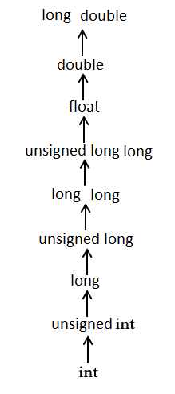

# C 强制类型转换

强制类型转换是把变量从一种类型转换为另一种数据类型。例如，如果您想存储一个 long 类型的值到一个简单的整型中，您需要把 long 类型强制转换为 int 类型。您可以使用**强制类型转换运算符**来把值显式地从一种类型转换为另一种类型，如下所示：

```
(type_name) expression
```
请看下面的实例，使用强制类型转换运算符把一个整数变量除以另一个整数变量，得到一个浮点数：

```
#include <stdio.h>

main()
{
   int sum = 17, count = 5;
   double mean;

   mean = (double) sum / count;
   printf("Value of mean : %f\n", mean );

}
```

当上面的代码被编译和执行时，它会产生下列结果：

```
Value of mean : 3.400000
```

这里要注意的是强制类型转换运算符的优先级大于除法，因此 **sum** 的值首先被转换为 **double** 型，然后除以 count，得到一个类型为 double 的值。

类型转换可以是隐式的，由编译器自动执行，也可以是显式的，通过使用**强制类型转换运算符**来指定。在编程时，有需要类型转换的时候都用上强制类型转换运算符，是一种良好的编程习惯。

## 整数提升

整数提升是指把小于 **int** 或 **unsigned int** 的整数类型转换为 **int** 或 **unsigned int** 的过程。请看下面的实例，在 int 中添加一个字符：

```
#include <stdio.h>

main()
{
   int  i = 17;
   char c = 'c'; /* ascii 值是 99 */
   int sum;

   sum = i + c;
   printf("Value of sum : %d\n", sum );

}
```
当上面的代码被编译和执行时，它会产生下列结果：

```
Value of sum : 116
```

在这里，sum 的值为 116，因为编译器进行了整数提升，在执行实际加法运算时，把 'c' 的值转换为对应的 ascii 值。

## 常用的算术转换

**常用的算术转换**是隐式地把值强制转换为相同的类型。编译器首先执行**整数提升**，如果操作数类型不同，则它们会被转换为下列层次中出现的最高层次的类型：


常用的算术转换不适用于赋值运算符、逻辑运算符 && 和 ||。让我们看看下面的实例来理解这个概念：

```
#include <stdio.h>

main()
{
   int  i = 17;
   char c = 'c'; /* ascii 值是 99 */
   float sum;

   sum = i + c;
   printf("Value of sum : %f\n", sum );

}
```
当上面的代码被编译和执行时，它会产生下列结果：

```
Value of sum : 116.000000
```
在这里，c 首先被转换为整数，但是由于最后的值是 double 型的，所以会应用常用的算术转换，编译器会把 i 和 c 转换为浮点型，并把它们相加得到一个浮点数。