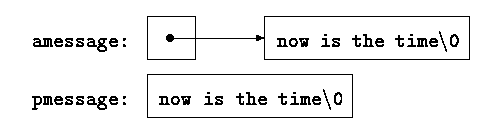

## 第5章 指针与数组

指针是一种保存变量地址的变量。在 C 语言中，指针的使用非常广泛，原因之一是，指针常常是表达某个计算的惟一途径，另一个原因是，同其它方法比较起来，使用指针通常可以生成更高效、更紧凑的代码。指针与数组之间的关系十分密切，我们将在本章中讨论它们之间的关系，并探讨如何利用这种关系。

指针和 goto 语句一样，会导致程序难以理解。如果使用者粗心，指针很容易就指向了错误的地方。但是，如果谨慎地使用指针，便可以利用它写出简单、清晰的程序。在本章中我们将尽力说明这一点。

ANSI C 的一个最重要的变化是，它明确地制定了操纵指针的规则。事实上，这些规则已经被很多优秀的程序设计人员和编译器所采纳。此外，ANSI C 使用类型 void \*（指向 void 的指针）代替 char \*作为通用指针的类型。

### 5.1.	指针与地址

首先，我们通过一个简单的示意图来说明内存是如何组织的。通常的机器都有一系列连续编号或编址的存储单元，过些存储单元可以单个进行操纵，也可以以连续成组的方式操纵。通常情况下，机器的一个字节可以存放一个 char 类型的数据，两个相邻的字节存储单元可存储一个 short（短整型）类型的数据，而 4 个相邻的字节存储单元可存储一个 long（长整型）类型的数据。指针是能够存放一个地址的一组存储单元（通常是两个或 4 个字节）。因此，如果 c 的类型是 char，并且 p 是指向 c 的指针，则可用图 5-1 表示它们之间的关系：


图 5-1

一元运算符&可用于取一个对象的地址，因此，下列语句：
```c
p = &c;
```
将把 c 的地址赋值给变量 p，我们称 p 为“指向” c 的指针。地址运算符&只能应用于内存中的对象，即变量与数组元素。它不能作用于表达式、常量或 register 类型的变量。

一元运算符\*是间接寻址或间接引用运算符。当它作用于指针时，将访问指针所指向的对象。我们在这里假定 x 与 y 是整数，而 ip 是指向 int 类型的指针，下面的代码段说明了如何在程序中声明指针以及如何使用运算符&和\*：
```c
int x = 1, y = 2, z[10];
int *ip;          /* ip is a pointer to int */

ip = &x;          /* ip now points to x */
y = *ip;          /* y is now 1 */
*ip = 0;          /* x is now 0 */
ip = &z;[0];       /* ip now points to z[0] */
```
变量 x、y 与 z 的声明方式我们已经在前面的章节中见到过。我们来看指针 ip 的声明，如下所示：
```c
int *ip;
```
这样声明是为了便于记忆。该声明语句表明表达式 \*ip 的结果是 int 类型。这种声明变量的语法与声明该变量所在表达式的语法类似。同样的原因，对函数的声明也可以采用这种方式。例如，声明
```c
double *dp，atof(char *);
```
表明，在表达式中，\*dp 和 atof(s)的值都是 double 类型，且 atof 的参数是一个指向 char类型的指针。

我们应该注意，指针只能指向某种特定类型的对象，也就是说，每个指针都必须指向某种特定的数据类型。（一个例外情况是指向 void 类型的指针可以存放指向任何类型的指针，但它不能间接引用其自身。我们将在 5.11 节中详细讨论该问题）。

如果指针 ip 指向整型变量，那么在 x 可以出现的任何上下文中都可以使用\*ip，因此，语句
```c
*ip = *ip + 10;
```
将把\*ip 的值增加 10。 一元运算符\*和&的优先级比算术运算符的优先级高，因此，赋值语句
```c
y = *ip + 1
```
将把\*ip 指向的对象的值取出并加 1，然后再将结果赋值给 y，而下列赋值语句：
```c
*ip += 1
```
则将 ip 指向的对象的值加 1，它等同于
```c
++*ip
```
或
```c
(*ip)++
```
语句的执行结果。语句(\*ip)++中的圆括号是必需的，否则，该表达式将对 ip 进行加 1 运算， 而不是对 ip 指向的对象进行加 1 运算，这是因为，类似于\*和++这样的一元运算符遵循从右至左的结合顺序。

最后说明一点，由于指针也是变量，所以在程序中可以直接使用，而不必通过间接引用的方法使用。例如，如果 iq 是另一个指向整型的指针，那么语句
```c
iq = ip
```
将把 ip 中的值拷贝到 iq 中，这样，指针 iq 也将指向 ip 指向的对象。

### 5.2.	指针与函数参数

由于 C 语言是以传值的方式将参数值传递给被调用函数。因此，被调用函数不能直接修改主调函数中变最的值。例如，排序函数可能会使用一个名为 swap 的函数来交换两个次序颠倒的元素。但是，如果将 swap 函数定义为下列形式：
```c
void swap(int x, int y)  /* WRONG */
{
    int temp;

    temp = x;
    x = y;
    y = temp;
}
```
则下列语句无法达到该目的。
```c
swap(a, b);
```
这是因为，由于参数传递采用传值方式，因此上述的 swap 函数不会影响到调用它的例程中的参数 a 和 b 的值。该函数仅仅交换了 a 和 b 的副本的值。

那么，如何实现我们的目标呢，可以使主调程序将指向所要交换的变量的指针传递给被调用函数，即：
```c
swap(&a, &b);
```
由于一元运算符&用来取变量的地址，这样 &a 就是一个指向变量 a 的指针。swap 函数的所有参数都声明为指针，并且通过这些指针来间接访问它们指向的操作数。
```c
void swap(int *px, int *py)  /* interchange *px and *py */
{
    int temp;

    temp = *px;
    *px = *py;
    *py = temp;
}
```
我们通过图 5-2 进行说明。


图 5-2

指针参数使得被调用函数能够访问和修改主调函数中对象的值。我们来看这样一个例子：函数 getint 接受自由格式的输入，并执行转换，将输入的字符流分解成整数，且每次调用得到一个整数。getint 需要返回转换后得到的整数，并且，在到达输入结尾时要返回文件结束标记。这些值必须通过不同的方式返回。EOF（文件结束标记）可以用任何值表示，当然也可用一个输入的整数表示。

可以这样设计该函数：将标识是否到达文件结尾的状态作为 getint 函数的返回值，同时，使用一个指针参数存储转换后得到的整数并传回给主调函数。函数 scanf 的实现就采用了这种方法，具体细节请参见 7.4 节。

下面的循环语句调用 getint 函数给一个整型数组赋值：
```c
int n, array[SIZE], getint(int *);

for (n = 0; n < SIZE && getint(&array;[n]) != EOF; n++)
    ;
```
每次调用 getint 时，输入流中的下一个整数将被赋值给数组元素 array[n]，同时，n 的值将增加 1。请注意，这里必须将 array[n]的地址传递给函数 getint，否则函数 getint 将无法把转换得到的整数传回给调用者。

该版本的 getint 函数在到达文件结尾时返回 EOF，当下一个输入不是数字时返回 0，当输入中包含一个有意义的数字时返回一个正值。
```c
#include <ctype.h>

int getch(void);
void ungetch(int);

/* getint:  get next integer from input into *pn */
int getint(int *pn)
{
    int c, sign;

    while (isspace(c = getch()))   /* skip white space */
        ;
    if (!isdigit(c) && c != EOF && c != '+' && c != '-') {
        ungetch(c);  /* it is not a number */
        return 0;
    }
    sign = (c == '-') ? -1 : 1;
    if (c == '+' || c == '-')
        c = getch();
    for (*pn = 0; isdigit(c), c = getch())
        *pn = 10 * *pn + (c - '0');
    *pn *= sign;
    if (c != EOF)
        ungetch(c);
    return c;
}
```
在 getint 函数中，\*pn 始终作为一个普通的整型变量使用。其中还使用了 getch 和 ungetch 两个函数（参见 4.3 节），借助这两个函数，函数 getint 必须读入的一个多余字符就可以重 新写回到输入中。

**练习 5-1**	在上面的例子中，如果符号+或-的后面紧跟的不是数字，getint 函数将把符号视为数字 0 的有效表达方式。修改该函数，将这种形式的+或-符号重新写回到输入流中。

**练习 5-2**	模仿函数 getint 的实现方法，编写一个读取浮点数的函数 getfloat。 getfloat 函数的返回值应该是什么类型？

### 5.3.     指针与数组

在 C 语言中，指针和数组之间的关系十分密切，因此，在接下来的部分中，我们将同时讨论指针与数组。通过数组下标所能完成的任何操作都可以通过指针来实现。一般来说，用指针编写的程序比用数组下标编写的程序执行速度快，但另一方面，用指针实现的程序理解起来稍微困难一些。
声明
```c
int a[10];
```
定义了一个长度为 10 的数组 a。换句话说，它定义了一个由 10 个对象组成的集合，这 10 个对象存储在相邻的内存区域中，名字分别为 a[0]、a[1]、…、a[9]（参见图 5-3）。


图 5-3

a[i]表示该数组的第 i 个元素。如果 pa 的声明为
```c
int *pa;
```
则说明它是一个指向整型对象的指针，那么，赋值语句
```c
pa = &a[0];
```
则可以将指针 pa 指向数组 a 的第 0 个元素，也就是说，pa 的值为数组元素 a[0]的地址（参见图 5-4）。


图 5-4

这样，赋值语句
```c
x = *pa;
```
将把数组元素 a[0]中的内容复制到变量 x 中。

如果 pa 指向数组中的某个特定元素，那么，根据指针运算的定义，pa+1 将指向下一个元素，pa+i 将指向 pa 所指向数组元素之后的第 i 个元素，而 pa-i 将指向 pa 所指向数组元素之前的第 i 个元素。因此，如果指针 pa 指向 a[0]，那么\*(pa+1)引用的是数组元素 a[1]的内容，pa+i 是数组元素 a[i]的地址，\*(pa+i)引用的是数组元素 a[i]的内容（参 见图 5-5）。


图 5-5

无论数组 a 中元素的类型或数组长度是什么，上面的结论都成立。“指针加 1”就意味着，pa+1 指向 pa 所指向的对象的下一个对象。相应地，pa+i 指向 pa 所指向的对象之后的第 i 个对象。

下标和指针运算之间具有密切的对应关系。根据定义，数组类型的变量或表达式的值是该数组第 0 个元素的地址。执行赋值语句
```c
pa = &a[0]；
```
后，pa 和 a 具有相同的值。因为数组名所代表的就是该数组最开始的一个元素的地址，所以，赋值语句 pa=&a[0]也可以写成下列形式：
```c
pa = a;
```
对数组元素 a[i]的引用也可以写成\*(a+i)这种形式。对第一次接触这种写法的人来说，可能会觉得很奇怪。在计算数组元素 a[i]的值时，C 语言实际上先将其转换为\*(a+i)的形式，然后再进行求值，因此在程序中这两种形式是等价的。如果对这两种等价的表示形式分别施加地址运算符&，便可以得出这样的结论：&a[i]和 a+i 的含义也是相同的。a+i 是 a 之后第 i 个元素的地址。相应地，如果 pa 是个指针，那么，在表达式中也可以在它的后面加下标。pa[i]与\*(pa+i)是等价的。简而言之，一个通过数组和下标实现的表达式可等价地通过指针和偏移量实现。

但是，我们必须记住，数组名和指针之间有一个不同之处，指针是一个变量，因此，在 C 语言中，语句 pa=a 和 pa++都是合法的。但数组名不是变量，因此，类似于 a=pa 和 a++形式的语句是非法的。

当把数组名传递给一个函数时，实际上传递的是该数组第一个元索的地址。在被调用函数中，该参数是一个局部变量，因此，数组名参数必须是一个指针，也就是一个存储地址值的变量。我们可以利用该特性编写 strlen 函数的另一个版本，该函数用于计算一个字符串的长度。
```c
/* strlen:  return length of string s */
int strlen(char *s)
{
    int n;

    for (n = 0; *s != '\0', s++)
        n++;
    return n;
}
```
因为 s 是一个指针，所以对其执行自增运算是合法的。执行 s++ 运算不会影响到 strlen 函数的调用者中的字符串，它仅对该指针在 strlen 函数中的私有副本进行自增运算。因此，类似于下面这样的函数调用：
```c
strlen("hello, world");   /* string constant */
strlen(array);            /* char array[100]; */
strlen(ptr);              /* char *ptr; */
```
都可以正确地执行。 在函数定义中，形式参数
```c
char s[];
```
和
```c
char *s;
```
是等价的。我们通常更习惯于使用后一种形式，因为它比前者更直观地表明了该参数是一个指针。如果将数组名传递给函数，函数可以根据情况判定是按照数组处理还是按照指针处理， 随后根据相应的方式操作该参数。为了直观且恰当地描述函数，在函数中甚至可以同时使用数组和指针这两种表示方法。

也可以将指向子数组起始位置的指针传递给函数，这样，就将数组的一部分传递给了函数。例如，如果 a 是一个数组，那么下面两个函数调用
```c
f(&a[2])
```
与
```c
f(a+2)
```
都将把起始于 a[2]的子数组的地址传递给函数 f。在函数 f 中，参数的声明形式可以为
```c
f(int arr[]) { ... }
```
或
```c
f(int *arr) { ... }
```
对于函数 f 来说，它并不关心所引用的是否只是一个更大数组的部分元素。

如果确信相应的元素存在，也可以通过下标访问数组第一个元素之前的元素。类似于p[-1]、p[-2]这样的表达式在语法上都是合法的，它们分别引用位于p[0]之前的两个元素。 当然，引用数组边界之外的对象是非法的。

### 5.4.	地址算术运算

如果 p 是一个指向数组中某个元素的指针，那么 p++将对 p 进行自增运算并指向下一个元素，而 p+=i 将对 p 进行加 i 的增量运算，使其指向指针 p 当前所指向的元素之后的第 i 个元素。这类运算是指针或地址算术运算中最简单的形式。

C 语言中的地址算术运算方法是一致且有规律的，将指针、数组和地址的算术运算集成在一起是该语言的一大优点。为了说明这一点，我们来看一个不完善的存储分配程序。它由两个函数组成。第一个函数 alloc(n)返回一个指向 n 个连续字符存储单元的指针，alloc 函 数的调用者可利用该指针存储字符序列。第二个函数 afree(p)释放已分配的存储空间，以便以后重用。之所以说这两个函数是“不完善的”，是因为对 afree 函数的调用次序必须与调用 alloc 函数的次序相反。换句话说，alloc 与 afree 以栈的方式（即后进先出的列表）进行存储空间的管理。标准库中提供了具有类似功能的函数 malloc 和 free，它们没有上述限制，我们将在 8.7 节中说明如何实现这些函数。

最容易的实现方法是让 alloc 函数对一个大字符数组 allocbuf 中的空间进行分配。该数组是 alloc 和 afree 两个函数私有的数组。由于函数 alloc 和 afree 处理的对象是指针而不是数组下标，因此，其它函数无需知道该数组的名字，这样，可以在包含 alloc 和 afree 的源文件中将该数组声明为 static 类型，使得它对外不可见。实际实现时，该数组甚至可以没有名字，它可以通过调用 malloc 函数或向操作系统申请一个指向无名存储块的指针获得。

allocbuf 中的空间使用状况也是我们需要了解的信息。我们使用指针 allocp 指向 allocbuf 中的下一个空闲单元。当调用 alloc 申请 n 个字符的空间时，alloc 检查 allocbuf 数组中有没有足够的剩余空间。如果有足够的空闲空间，则 alloc 返回 allocp 的当前值（即空闲块的开始位置），然后将 allocp 加 n 以使它指向下一个空闲区域。如果空闲空间不够，则 alloc 返回 0。如果 p 在 allocbuf 的边界之内，则 afree(p)仅仅只是将 allocp 的值设置为 p（参见图 5-6）。
```c
#define ALLOCSIZE 10000 /* size of available space */

static char allocbuf[ALLOCSIZE]; /* storage for alloc */
static char *allocp = allocbuf;  /* next free position */

char *alloc(int n)    /* return pointer to n characters */
{
    if (allocbuf + ALLOCSIZE - allocp >= n) {  /* it fits */
        allocp += n;
        return allocp - n; /* old p */
    } else      /* not enough room */
        return 0;
}

void afree(char *p)  /* free storage pointed to by p */
{
    if (p >= allocbuf && p < allocbuf + ALLOCSIZE)
        allocp = p;
}
```


图 5-6

一般情况下，同其它类型的变量一样，指针也可以初始化。通常，对指针有意义的初始化值只能是 0 或者是表示地址的表达式，对后者来说，表达式所代表的地址必须是在此前已定义的具有适当类型的数据的地址。例如，声明
```c
static char* allocp = allocbuf;
```
将 allocp 定义为字符类型指针，并将它初始化为 allocbuf 的起始地址，该起始地址是程序执行时的下一个空闲位置。上述语句也可以写成下列形式：
```c
static char* allocp = &allocbuf[0];
```
这是因为该数组名实际上就是数组第 0 个元素的地址。

下列 if 测试语句：
```c
if (allocbuf + ALLOCSIZE - allocp >= n) { /* it fits */
```
检查是否有足够的空闲空间以满足 n 个字符的存储空间请求。如果空闲空间足够，则分配存储空间后 allocp 的新值至多比 allocbuf 的尾端地址大 1。如果存储空间的申请可以满足，alloc 将返回一个指向所需大小的字符块首地址的指针（注意函数本身的声明）。如果申请无法满足，alloc 必须返回某种形式的信号以说明没有足够的空闲空间可供分配。C 语言保证， 0 永远不是有效的数据地址，因此，返回值 0 可用来表示发生了异常事件。在本例中，返回值0 表示没有足够的空闲空间可供分配。

指针与整数之间不能相互转换，但 0 是惟一的例外：常量 0 可以赋值给指针，指针也可以和常量 0 进行比较。程序中经常用符号常量 NULL 代替常量 0，这样便于更清晰地说明常量 0 是指针的一个特殊值。符号常量 NULL 定义在标准头文件`<stddef.h>`中。我们在后面部分经常会用到 NULL。

类似于
```c
if (allocbuf + ALLOCSIZE - allocp >= n) {  /* it fits */
```
以及
```c
if (p >= allocbuf && p < allocbuf + ALLOCSIZE)
```
的条件测试语句表明指针算术运算有以下几个重要特点。首先，在某些情况下对指针可以进行比较运算。例如，如果指针 p 和 q 指向同一个数组的成员，那么它们之间就可以进行类似于==、!=、<、>=的关系比较运算。如果 p 指向的数组元素的位置在 q 指向的数组元素位置之前，那么关系表达式
```c
p < q
```
的值为真。任何指针与 0 进行相等或不等的比较运算都有意义。但是，指向不同数组的元素的指针之间的算术或比较运算没有定义。（这里有一个特例：指针的算术运算中可使用数组最后一个元素的下一个元素的地址。）

其次。我们从前面可以看到，指针可以和整数进行相加或相减运算。例如，结构
```c
p + n
```
表示指针 p 当前指向的对象之后第 n 个对象的地址。无论指针 p 指向的对象是何种类型，上述结论都成立。在计算 p+n 时，n 将根据 p 指向的对象的长度按比例缩放，而 p 指向的对象的长度则取决于 p 的声明。例如，如果 int 类型占 4 个字节的存储空间，那么在 int 类型的计算中，对应的 n 将按 4 的倍数来计算。

指针的减法运算也是有意义的：如果 p 和 q 指向相同数组中的元索，且 p<q，那么 q-p+1 就是位于 p 和 q 指向的元索之间的元素的数目。我们由此可以编写出函数 strlen 的另一个版本，如下所示：
```c
/* strlen:  return length of string s */
int strlen(char *s)
{
    char *p = s;

    while (*p != '\0')
        p++;
    return p - s;
}
```
在上述程序段的声明中，指针 p 被初始化为指向 s，即指向该字符串的第一个字符。whi1e 循环语句将依次检查字符串中的每个字符，直到遇到标识字符数组结尾的字符'\0'为止。由于 p 是指向字符的指针，所以每执行一次 p++，p 就将指向下一个字符的地址，p-s 则表示已经检查过的字符数，即字符串的长度。（字符串中的字符数有可能超过 int 类型所能表示的最大范围。头文件`<stddef.h>`中定义的类型 ptrdiff_t 足以表示两个指针之间的带符号差值。但是，我们在这里使用 size_t 作为函数 strlen 的返回值类型，这样可以与标准库中的函数版本相匹配。Size_t 是由运算符 sizeof 返回的无符号整型。）

指针的算术运算具有一致性：如果处理的数据类型是比字符型占据更多存储空间的浮点类型，并且 p 是一个指向浮点类型的指针，那么在执行 p++后，p 将指向下一个浮点数的地址。因此，只需要将 alloc 和 afree 函数中所有的 char 类型替换为 float 类型，就可以得到一个适用于浮点类型而非字符型的内存分配函数。所有的指针运算都会自动考虑它所指向的对象的长度。

有效的指针运算包括相同类型指针之间的赋值运算；指针同整数之间的加法或减法运算；指向相同数组中元素的两个指针间的减法或比较运算；将指针赋值为 0 或指针与 0 之间的比较运算。其它所有形式的指针运算都是非法的，例如两个指针间的加法、乘法、除法、移位或屏蔽运算；指针同 float 或 double 类型之间的加法运算；不经强制类型转换而直接将指向一种类型对象的指针赋值给指向另一种类型对象的指针的运算（两个指针之一是 void \* 类型的情况除外）。

### 5.5.     字符指针与函数

字符串常量是一个字符数组，例如：
```c
"I am a string"
```
在字符串的内部表示中，字符数组以空字符'\0'结尾，所以，程序可以通过检查空字符找到字符数组的结尾。字符串常量占据的存储单元数也因此比双引号内的字符数大 1。

字符串常量最常见的用法也许是作为函数参数，例如：
```c
printf("hello, world\n");
```
当类似于这样的一个字符串出现在程序中时，实际上是通过字符指针访问该字符串的。在上述语句中，printf 接受的是一个指向字符数组第一个字符的指针。也就是说，字符串常量可通过一个指向其第一个元素的指针访问。

除了作为函数参数外，字符串常量还有其它用法。假定指针 pmessage 的声明如下：
```c
char *pmessage;
```
那么，语句
```c
pmessage ="now is the time";
```
将把一个指向该字符数组的指针赋值给 pmessage。该过程并没有进行字符串的复制，而只是涉及到指针的操作。C 语言没有提供将整个字符串作为一个整体进行处理的运算符。

下面两个定义之间有很大的差别：
```c
char amessage[] = "nw is the time";	/* 定义一个数组 */
char *pmessage = "now is the time";	/* 定义一个指针 */
```
上述声明中，amessage 是一个仅仅足以存放初始化字符串以及空字符'\0'的一维数组。数组中的单个字符可以进行修改，但 amessage 始终指向同一个存储位置。另一方面，pmessage 是一个指针，其初值指向一个字符串常量，之后它可以被修改以指向其它地址，但如果试图修改字符串的内容，结果是没有定义的（参见图 5-7）。



图 5-7

为了更进一步地讨论指针和数组其它方面的问题，下面以标准库中两个有用的函数为例来研究它们的不同实现版本。第一个函数 strcpy(s, t)把指针 t 指向的字符串复制到指针 s 指向的位置。如果使用语句 s=t 实现该功能，其实质上只是拷贝了指针，而并没有复制字符。为了进行字符的复制，这里使用了一个循环语句。strcpy 函数的第 1 个版本是通过数组方法实现的，如下所示：
```c
/* strcpy:  copy t to s; array subscript version */
void strcpy(char *s, char *t)
{
    int i;

    i = 0;
    while ((s[i] = t[i]) != '\0')
        i++;
}
```
为了进行比较，下面是用指针方法实现的 strcpy 函数：
```c
/* strcpy:  copy t to s; pointer version */
void strcpy(char *s, char *t)
{
    int i;

    i = 0;
    while ((*s = *t) != '\0') {
        s++;
        t++;
    }
}
```
因为参数是通过值传递的，所以在 strcpy 函数中可以以任何方式使用参数 s 和 t。在此，s 和 t 是方便地进行了初始化的指针，循环每执行一次，它们就沿着相应的数组前进一个字符，直到将 t 中的结束符'\0'复制到 s 为止。

实际上，strcpy 函数并不会按照上面的这些方式编写。经验丰富的程序员更喜欢将它编写成下列形式：
```c
/* strcpy:  copy t to s; pointer version 2 */
void strcpy(char *s, char *t)
{
    while ((*s++ = *t++) != '\0')
        ;
}
```
在该版本中，s 和 t 的自增运算放到了循环的测试部分中。表达式*t++的值是执行自增运算之前 t 所指向的字符。后缀运算符++表示在读取该字符之后才改变 t 的值。同样的道理， 在 s 执行自增运算之前，字符就被存储到了指针 s 指向的旧位置。该字符值同时也用来和空字符'\0'进行比较运算，以控制循环的执行。最后的结果是依次将 t 指向的字符复制到 s 指向的位置，直到遇到结束符'\0'为止（同时也复制该结束符），了更进一步地精炼程序，我们注意到，表达式同'\0'的比较是多余的，因为只需要判断表达式的值是否为 0 即可。因此，该函数可进一步写成下列形式：
```c
/* strcpy:  copy t to s; pointer version 3 */
void strcpy(char *s, char *t)
{
    while (*s++ = *t++)
        ;
}
```
该函数初看起来不太容易理解，但这种表示方法是很有好处的，我们应该掌握这种方法，C 语言程序中经常会采用这种写法。

标准库（`<string.h>`）中提供的函数 strcpy 把目标字符串作为函数值返回。

我们研究的第二个函数是字符串比较函数 strcmp(s, t)。该函数比较字符串 s 和 t， 并且根据 s 按照字典顺序小于、等于或大于 t 的结果分别返回负整数、0 或正整数。该返回值是 s 和 t 由前向后逐字符比较时遇到的第一个不相等字符处的字符的差值。
```c
/* strcmp:  return <0 if s<t, 0 if s==t, >0 if s>t */
int strcmp(char *s, char *t)
{
    int i;

    for (i = 0; s[i] == t[i]; i++)
        if (s[i] == '\0')
            return 0;
    return s[i] - t[i];
}
```
下面用是指针方式实现的 strcmp 函数：
```c
/* strcmp:  return <0 if s<t, 0 if s==t, >0 if s>t */
int strcmp(char *s, char *t)
{
    for ( ; *s == *t; s++, t++)
        if (*s == '\0')
            return 0;
    return *s - *t;
}
```
由于++和--既可以作为前缀运算符，也可以作为后缀运算符，所以还可以将运算符\*与运算符++和--按照其它方式组合使用，但这些用法并不多见。例如，下列表达式
```c
*--p
```
在读取指针 p 指向的字符之前先对 p 执行自减运算。事实上，下面的两个表达式：
```c
*p++ = val;	/* 将 val 压入栈 */
val = *--p;	/* 将栈顶元素弹出到 val 中 */
```
是进栈和出栈的标准用法。更详细的信息，请参见 4.3 节。

头文件`<string.h>`中包含本节提到的函数的声明，另外还包括标准库中其它一些字符串处理函数的声明。

**练习 5-3**	用指针方式实现第 2 章中的函数 strcat。函数 strcat(s, t)将 t 指向的字符串复制到 s 指向的字符串的尾部。

**练习 5-4**	编写函数 strend(s, t)。如果字符串 t 出现在字符串 s 的尾部，该函数返回 1；否则返回 0。

**练习 5-5**	实现库函数 strncpy、strncat 和 strncmp，它们最多对参数字符串中的前 n 个字符进行操作。例如，函数 strncpy(s, t, n)将 t 中最多前 n 个字符复制到 s 中。更详细的说明请参见附录 B。

**练习 5-6** 采用指针而非数组索引方式改写前面章节和练习中的某些程序，例如 getline（第 1、4 章），atoi、itoa 以及它们的变体形式（第 2、3、4 章），reverse（第 3 章），strindex、getop（第 4 章）等等。

### 5.6.     指针数组以及指向指针的指针

由于指针本身也是变量，所以它们也可以像其它变量一样存储在数组中。下面通过编写 UNIX 程序 sort 的一个简化版本说明这一点。该程序按字母顺序对由文本行组成的集合进行排序。

我们在第 3 章中曾描述过一个用于对整型数组中的元素进行排序的 shell 排序函数，并在第 4 章中用快速排序算法对它进行了改进。这些排序算法在此仍然是有效的，但是，现在处理的是长度不一的文本行。并且与整数不同的是，它们不能在单个运算中完成比较或移动操作。我们需要一个能够高效、方便地处理可变长度文本行的数据表示方法。

我们引入指针数组处理这种问题。如果待排序的文本行首尾相连地存储在一个长字符数组中，那么每个文本行可通过指向它的第一个字符的指针来访问。这些指针本身可以存储在一个数组中。这样，将指向两个文本行的指针传递给函数 strcmp 就可实现对这两个文本行的比较。当交换次序颠倒的两个文本行时，实际上交换的是指针数组中与这两个文本行相对应的指针，而不是这两个文本行本身（参见图 5-8）。


图 5-8

这种实现方法消除了因移动文本行本身所带来的复杂的存储管理和巨大的开销这两个孪生问题。

排序过程包括下列 3 个步骤：
```
读取所有输入行
对文本行进行排序
按次序打印文本行
```
通常情况下，最好将程序划分成若干个与问题的自然划分相一致的函数，并通过主函数控制其它函数的执行。关于对文本行排序这一步，我们稍后再做说明，现在主要考虑数据结构以及输入和输出函数。

输入函数必须收集和保存每个文本行中的字符，并建立一个指向这些文本行的指针的数组。它同时还必须统计输入的行数，因为在排序和打印时要用到这一信息。由于输入函数只 能处理有限数目的输入行，所以在输入行数过多而超过限定的最大行数时，该函数返回某个用于表示非法行数的数值，例如-1。

输出函数只需要按照指针数组中的次序依次打印这些文本行即可。
```c
#include <stdio.h>
#include <string.h>

#define MAXLINES 5000     /* max #lines to be sorted */

char *lineptr[MAXLINES];  /* pointers to text lines */

int readlines(char *lineptr[], int nlines);
void writelines(char *lineptr[], int nlines);

void qsort(char *lineptr[], int left, int right);

/* sort input lines */
main()
{
    int nlines;     /* number of input lines read */

    if ((nlines = readlines(lineptr, MAXLINES)) >= 0) {
        qsort(lineptr, 0, nlines-1);
        writelines(lineptr, nlines);
        return 0;
    } else {
        printf("error: input too big to sort\n");
        return 1;
    }
}

#define MAXLEN 1000  /* max length of any input line */
int getline(char *, int);
char *alloc(int);

/* readlines:  read input lines */
int readlines(char *lineptr[], int maxlines)
{
    int len, nlines;
    char *p, line[MAXLEN];

    nlines = 0;
    while ((len = getline(line, MAXLEN)) > 0)
        if (nlines >= maxlines || p = alloc(len) == NULL)
            return -1;
        else {
            line[len-1] = '\0';  /* delete newline */
            strcpy(p, line);
            lineptr[nlines++] = p;
        }
    return nlines;
}

/* writelines:  write output lines */
void writelines(char *lineptr[], int nlines)
{
    int i;

    for (i = 0; i < nlines; i++)
        printf("%s\n", lineptr[i]);
}
```
有关函数 getline 的详细信息参见 1.9 节。 在该例子中，指针数组 1ineptr 的声明是新出现的重要概念： char \*lineptr[MAXLINES];
它表示 1ineptr 是一个具有 MAXLINES 个元素的一维数组，其中数组的每个元素是一个指向字符类型对象的指针。也就是说，lineptr[i]是一个字符指针，而\*lineptr[i]是该指针指向的第 i 个文本行的首字符。

由于 1ineptr 本身是一个数组名，因此，可按照前面例子中相同的方法将其作为指针使用，这样，writelines 函数可以改写为：
```c
/* writelines:  write output lines */
void writelines(char *lineptr[], int nlines)
{
    while (nlines-- > 0)
        printf("%s\n", *lineptr++);
}
```
（注意这里的数组变量 lineptr 可以改变值）

循环开始执行时，\*lineptr 指向第一行，每执行一次自增运算都使得 lineptr 指向下一行，同时对 nlines 进行自减运算。

在明确了输入和输出函数的实现方法之后，下面便可以着手考虑文本行的排序问题了。 在这里需要对第 4 章的快速排序函数做一些小改动：首先，需要修改该函数的声明部分；其次，需要调用 strcmp 函数完成文本行的比较运算。但排序算法在这里仍然有效，不需要做任何改动。
```c
/* qsort:  sort v[left]...v[right] into increasing order */
void qsort(char *v[], int left, int right)
{
    int i, last;
    void swap(char *v[], int i, int j);

    if (left >= right)  /* do nothing if array contains */
        return;         /* fewer than two elements */
    swap(v, left, (left + right)/2);
    last = left;
    for (i = left+1; i <= right; i++)
        if (strcmp(v[i], v[left]) < 0)
            swap(v, ++last, i);
    swap(v, left, last);
    qsort(v, left, last-1);
    qsort(v, last+1, right);
}
```
同样，swap 函数也只需要做一些很小的改动：
```c
/* swap:  interchange v[i] and v[j] */
void swap(char *v[], int i, int j)
{
    char *temp;

    temp = v[i];
    v[i] = v[j];
    v[j] = temp;
}
```
因为 v（别名为 lineptr）的所有元素都是字符指针，并且 temp 也必须是字符指针，因此temp 与 v 的任意元素之间可以互相复制。

**练习 5-7**	重写函数 readlines，将输入的文本行存储到由 main 函数提供的一个数组中，而不是存储到调用 alloc 分配的存储空间中。该函数的运行速度比改写前快多少？

### 5.7.	多维数组

C 语言提供了类似于矩阵的多维数组，但实际上它们并不像指针数组使用得那样广泛。本节将对多维数组的特性进行介绍。

我们考虑一个日期转换的问题，把某月某日这种日期表示形式转换为某年中第几天的表示形式，反之亦然。例如，3 月 1 日是非闰年的第 60 天，是闰年的第 61 天。在这里，我们定义下列两个函数以进行日期转换：函数 day_of_year 将某月某日的日期表示形式转换为某一年中第几天的表示形式，函数 month_day 则执行相反的转换。因为后一个函数要返回两个值，所以在函数 month_day 中，月和日这两个参数使用指针的形式。例如，下列语句：
```c
month_day(1988, 60, &m;, &d;)
```
将把 m 的值设置为 2，把 d 的值设置为 29（2 月 29 日）。

这些函数都要用到一张记录每月天数的表（如“9 月有 30 天”等）。对闰年和非闰年来说，每个月的天数不同，所以，将这些天数分别存放在一个二维数组的两行中比在计算过程中判断 2 月有多少天更容易。该数组以及执行日期转换的函数如下所示：
```c
static char daytab[2][13] = {
    {0, 31, 28, 31, 30, 31, 30, 31, 31, 30, 31, 30, 31},
    {0, 31, 29, 31, 30, 31, 30, 31, 31, 30, 31, 30, 31}
};

/* day_of_year:  set day of year from month & day */
int day_of_year(int year, int month, int day)
{
    int i, leap;
    leap = year%4 == 0 && year%100 != 0 || year%400 == 0;
    for (i = 1; i < month; i++)
        day += daytab[leap][i];
    return day;
}

/* month_day:  set month, day from day of year */
void month_day(int year, int yearday, int *pmonth, int *pday)
{
    int i, leap;

    leap = year%4 == 0 && year%100 != 0 || year%400 == 0;
    for (i = 1; yearday > daytab[leap][i]; i++)
        yearday -= daytab[leap][i];
    *pmonth = i;
    *pday = yearday;
}
```
我们在前面的章节中曾讲过，逻辑表达式的算术运算值只可能是 0（为假时）或者 1（为真时）。因此，在本例中，可以将逻辑表达式 leap 用做数组 daytab 的下标。

数组 daytab 必须在函数 day_of_year 和 month_day 的外部进行声明，这样，这两个函数都可以使用该数组。这里之所以将 daytab 的元素声明为 char 类型，是为了说明在 char 类型的变量中存放较小的非字符整数也是合法的。

到目前为止，daytab 是我们遇到的第一个二维数组。在 C 语言中，二维数组实际上是一种特殊的一维数组，它的每个元素也是一个一维数组。因此，数组下标应该写成
```c
daytab[i][j]    /* [row][col] */
```
而不能写成
```c
daytab[i,j]    /* WRONG */
```
除了表示方式的区别外，C 语言中二维数组的使用方式和其它语言一样。数组元素按行存储，因此，当按存储顺序访问数组时，最右边的数组下标（即列）变化得最快。

数组可以用花括号括起来的初值表进行初始化，二维数组的每一行由相应的子列表进行初始化。在本例中，我们将数组 daytab 的第一列元素设置为 0，这样，月份的值为 1～12，而不是 0～11。由于在这里存储空间并不是主要问题，所以这种处理方式比在程序中调整数组的下标更加直观。

如果将二维数组作为参数传递给函数，那么在函数的参数声明中必须指明数组的列数。数组的行数没有太大关系，因为前面已经讲过，函数调用时传递的是一个指针，它指向由行向量构成的一维数组，其中每个行向量是具有 13 个整型元素的一维数组。在该例子中，传递给函数的是一个指向很多对象的指针，其中每个对象是由 13 个整型元素构成的一维数组。因此，如果将数组 daytab 作为参数传递给函数 f，那么 f 的声明应该写成下列形式：
```c
f(int daytab[2][13]) { ... }
```
也可以写成
```c
f(int daytab[][13]) { ... }
```
因为数组的行数无关紧要，所以，该声明还可以写成
```c
f(int (*daytab)[13]) { ... }
```
这种声明形式表明参数是一个指针，它指向具有 13 个整型元素的一维数组。因为方括号[]的优先级高于\*的优先级，所以上述声明中必须使用圆括号。如果去掉括号，则声明变成
```c
int *daytab[13]
```
这相当于声明了一个数组，该数组有 13 个元素，其中每个元素都是一个指向整型对象的指针。一般来说，除数组的第一维（下标）可以不指定大小外，其余各维都必须明确指定大小。

我们将在 5.12 节中进一步讨论更复杂的声明。

**练习 5-8**	函数 day_of_year 和 month_day 中没有进行错误检查，请解决该问题。

### 5.8.	指针数组的初始化

考虑这样一个问题：编写一个函数 month_name(n)，它返回一个指向第 n 个月名字的字符串的指针。这是内部 static 类型数组的一种理想的应用。month_name 函数中包含一个私有的字符串数组，当它被调用时，返回一个指向正确元素的指针。本节将说明如何初始化该名字数组。

指针数组的初始化语法和前面所讲的其它类型对象的初始化语法类似：
```c
/* month_name:  return name of n-th month */
char *month_name(int n)
{
    static char *name[] = {
        "Illegal month",
        "January", "February", "March",
        "April", "May", "June",
        "July", "August", "September",
        "October", "November", "December"
    };

    return (n < 1 || n > 12) ? name[0] : name[n];
}
```
其中，name 的声明与排序例子中 lineptr 的声明相同，是一个一维数组，数组的元素为字符指针。name 数组的初始化通过一个字符串列表实现，列表中的每个字符串赋值给数组相应位置的元素。第 i 个字符串的所有字符存储在存储器中的某个位置，指向它的指针存储在 name[i]中。由于上述声明中没有指明 name 的长度，因此，编译器编译时将对初值个数进行统计，并将这一准确数字填入数组的长度。

### 5.9.	指针与多维数组

对于 C 语言的初学者来说，很容易混淆二维数组与指针数组之间的区别，比如上面例子中的 name。假如有下面两个定义：
```c
int a[10][20];
int *b[10];
```
那么，从语法角度讲，a[3][4]和 b[3][4]都是对一个 int 对象的合法引用。但 a 是一个真正的二维数组，它分配了 200 个 int 类型长度的存储空间，并且通过常规的矩阵下标计算公式 20×row+col（其中，row 表示行，col 表示列）计算得到元素 a[row][col]的位置。但是， 对 b 来说，该定义仅仅分配了 10 个指针，并且没有对它们初始化，它们的初始化必须以显式的方式进行，比如静态初始化或通过代码初始化。假定 b 的每个元素都指向一个具有 20 个元素的数组，那么编译器就要为它分配 200 个 int 类型长度的存储空间以及 10 个指针的存储空间。指针数组的一个重要优点在于，数组的每一行长度可以不同，也就是说，b 的每个元素不必都指向一个具有 20 个元素的向量，某些元素可以指向具有 2 个元素的向量，某些元素可以指向具有 50 个元素的向量，而某些元素可以不指向任何向量。

尽管我们在上面的讨论中都是借助于整型进行讨论，但到目前为止，指针数组最频繁的用处是存放具有不同长度的字符串，比如函数 month_name 中的情况。结合下面的声明和图形化描述，我们可以做一个比较。下面是指针数组的声明和图形化描述（参见图 5-9）：
```c
char *name[] = { "Illegal month", "Jan", "Feb", "Mar" };
```


图 5-9

下面是二维数组的声明和图形化描述（参见图 5-10）：
```c
char aname[][15] = { "Illegal month", "Jan", "Feb", "Mar" };
```


图 5-10

**练习 5-9**	用指针方式代替数组下标方式改写函数 day_of_year 和 month_day。

### 5.10.	命令行参数

在支持 C 语言的环境中，可以在程序开始执行时将命令行参数传递给程序。调用主函数 main 时，它带有两个参数。第一个参数（习惯上称为 argc，用于参数计数）的值表示运行程序时命令行中参数的数目；第二个参数（称为 argv，用于参数向量）是一个指向字符串数组的指针，其中每个字符串对应一个参数。我们通常用多级指针处理这些字符串。

最简单的例子是程序 echo，它将命令行参数回显在屏幕上的一行中，其中命令行中各参数之间用空格隔开。也就是说，命令
```
echo hello, world
```
将打印下列输出：
```
hello, world
```
按照 C 语言的约定，argv[0]的值是启动该程序的程序名，因此 argc 的值至少为 1。 如果 argc 的值为 1，则说明程序名后面没有命令行参数。在上面的例子中，argc 的值为 3， argv[0]、argv[1]和 argv[2]的值分别为“echo”、 “hello,”，以及“world”。第一个可选参数为 argv[1]，而最后一个可选参数为 argv[argc-1]。另外，ANSI 标准要求 argv[argc]的值必须为一空指针(参见图 5-11)。


图 5-11

程序 echo 的第一个版本将 argv 看成是一个字符指针数组：
```c
#include <stdio.h>

/* echo command-line arguments; 1st version */
main(int argc, char *argv[])
{
    int i;

    for (i = 1; i < argc; i++)
        printf("%s%s", argv[i], (i < argc-1) ? " " : "");
    printf("\n");
    return 0;
}
```
因为 argv 是一个指向指针数组的指针，所以，可以通过指针而非数组下标的方式处理命令行参数。echo 程序的第二个版本是在对 argv 进行自增运算、对 argc 进行自减运算的基础上实现的，其中 argv 是一个指向 char 类型的指针的指针：
```c
#include <stdio.h>

/* echo command-line arguments; 2nd version */
main(int argc, char *argv[])
{
    while (--argc > 0)
        printf("%s%s", *++argv, (argc > 1) ? " " : "");
    printf("\n");
    return 0;
}
```
因为 argv 是一个指向参数字符串数组起始位置的指针，所以，自增运算（++argv）将使得 它在最开始指向 argv[1]而非 argv[0]。每执行一次自增运算，就使得 argv 指向下一个参数，\*argv 就是指向那个参数的指针。与此同时，argc 执行自减运算，当它变成 0 时，就完成了所有参数的打印。

也可以将 printf 语句写成下列形式：
```c
printf((argc > 1) ? "%s " : "%s", *++argv);
```
这就说明，printf 的格式化参数也可以是表达式。

我们来看第二个例子。在该例子中，我们将增强 4.1 节中模式查找程序的功能。在 4.1 节中，我们将查找模式内置到程序中了，这种解决方法显然不能令人满意。下面我们来效仿 UNIX 程序 grep 的实现方法改写模式查找程序，通过命令行的第一个参数指定待匹配的模式。
```c
#include <stdio.h>
#include <string.h>
#define MAXLINE 1000

int getline(char *line, int max);

/* find:  print lines that match pattern from 1st arg */
main(int argc, char *argv[])
{
    char line[MAXLINE];
    int found = 0;

    if (argc != 2)
        printf("Usage: find pattern\n");
    else
        while (getline(line, MAXLINE) > 0)
            if (strstr(line, argv[1]) != NULL) {
                printf("%s", line);
                found++;
            }
    return found;
}
```
标准库函数 strstr(s, t)返回一个指针，该指针指向字符串 t 在字符串 s 中第一次出现的位置；如果字符串 t 没有在字符串 s 中出现，函数返回 NULL（空指针）。该函数声明在头文件`<string.h>`中。

为了更进一步地解释指针结构，我们来改进模式查找程序。假定允许程序带两个可选参数。其中一个参数表示“打印除匹配模式之外的所有行”，另一个参数表示“每个打印的文本行前面加上相应的行号”。

UNIX 系统中的 C 语言程序有一个公共的约定：以负号开头的参数表示一个可选标志或参数。假定用-x（代表“除……之外”）表示打印所有与模式不匹配的文本行，用-n（代表“行号”）表示打印行号，那么下列命令：
```
find -x -n 模式
```
将打印所有与模式不匹配的行，并在每个打印行的前面加上行号。

可选参数应该允许以任意次序出现，同时，程序的其余部分应该与命令行中参数的数目无关。此外，如果可选参数能够组合使用，将会给使用者带来更大的方便，比如：
```
find -nx 模式
```
改写后的模式查找程序如下所示：
```c
#include <stdio.h>
#include <string.h>
#define MAXLINE 1000

int getline(char *line, int max);

/* find: print lines that match pattern from 1st arg */
main(int argc, char *argv[])
{
    char line[MAXLINE];
    long lineno = 0;
    int c, except = 0, number = 0, found = 0;

    while (--argc > 0 && (*++argv)[0] == '-')
        while (c = *++argv[0])
            switch (c) {
            case 'x':
                except = 1;
                break;
            case 'n':
                number = 1;
                break;
            default:
                printf("find: illegal option %c\n", c);
                argc = 0;
                found = -1;
                break;
            }
    if (argc != 1)
        printf("Usage: find -x -n pattern\n");
    else
        while (getline(line, MAXLINE) > 0) {
            lineno++;
            if ((strstr(line, *argv) != NULL) != except) {
                if (number)
                    printf("%ld:", lineno);
                printf("%s", line);
                found++;
            }
        }
    return found;
}
```
在处理每个可选参数之前，argc 执行自减运算，argv 执行自增运算。循环语句结束时，如果没有错误，则 argc 的值表示还没有处理的参数数目，而 argv 则指向这些未处理参数中的第一个参数。因此，这时 argc 的值应为 1，而\*argv 应该指向模式。注意，\*++argv 是一个指向参数字符串的指引，因此(\*++argv)[0]是它的第一个字符（另一种有效形式是\*\*++argv）。因为[]与操作数的结合优先级比\*和++高，所以在上述表达式中必须使用圆括号，否则编译器将会把该表达式当做\*++(argv[0])。实际上，我们在内层循环中就使用了表达式\*++argv[0]，其目的是遍历一个特定的参数串。在内层循环中，表达式\*++argv[0] 对指针 argv[0] 进行了自增运算。

很少有人使用比这更复杂的指针表达式。如果遇到这种情况，可以将它们分为两步或三步来理解，这样会更直观一些。

**练习 5-10**	编写程序 expr，以计算从命令行输入的逆波兰表达式的值，其中每个运算符或操作数用一个单独的参数表示。例如，命令
```
expr 2 3 4 + *
```
将计算表达式 2 × (3 + 4)的值。

**练习 5-11**	修改程序 entab 和 decab（第 1 章练习中编写的函数），使它们接受一组作为参数的制表符停止位。如果启动程序时不带参数，则使用默认的制表符停止位设置。

**练习 5-12**	对程序 entab 和 detab 的功能做一些扩充，以接受下列缩写的命令：
```
entab –m  +n
```
表示制表符从第 m 列开始，每隔 n 列停止。选择（对使用者而言）比较方便的默认行为。

**练习 5-13**	编写程序 tail，将其输入中的最后 n 行打印出来。默认情况下，n 的值为10，但可通过一个可选参数改变 n 的值，因此，命令
```
tail -n
```
将打印其输入的最后 n 行。无论输入或 n 的值是否合理，该程序都应该能正常运行。编写的程序要充分地利用存储空间；输入行的存储方式应该同 5.6  节中排序程序的存储方式一样，而不采用固定长度的二维数组。

### 5.11.	指向函数的指针

在 C 语言中，函数本身不是变量，但可以定义指向函数的指针。这种类型的指针可以被赋值、存放在数组中、传递给函数以及作为函数的返回值等等。为了说明指向函数的指针的用法，我们接下来将修改本章前面的排序函数，在给定可选参数 -n 的情况下，该函数将按数值大小而非字典顺序对输入行进行排序。

排序程序通常包括 3 部分：判断任何两个对象之间次序的比较操作、颠倒对象次序的交换操作、一个用于比较和交换对象直到所有对象都按正确次序排列的排序算法。由于排序算法与比较、交换操作无关，因此，通过在排序算法中调用不同的比较和交换函数，便可以实现按照不同的标准排序。这就是我们的新版本排序函数所采用的方法。

我们在前面讲过，函数 strcmp 按字典顺序比较两个输入行。在这里，我们还需要一个 以数值为基础来比较两个输入行，并返回与 strcmp 同样的比较结果的函数 numcmp。这些函数在 main 之前声明，并且，指向恰当函数的指针将被传递给 qsort 函数。在这里，参数的出错处理并不是问题的重点，我们将主要考虑指向函数的指针问题。
```c
#include <stdio.h>
#include <string.h>

#define MAXLINES 5000     /* max #lines to be sorted */
char *lineptr[MAXLINES];  /* pointers to text lines */

int readlines(char *lineptr[], int nlines);
void writelines(char *lineptr[], int nlines);

void qsort(void *lineptr[], int left, int right,
            int (*comp)(void *, void *));
int numcmp(char *, char *);

/* sort input lines */
main(int argc, char *argv[])
{
    int nlines;        /* number of input lines read */
    int numeric = 0;   /* 1 if numeric sort */

    if (argc > 1 && strcmp(argv[1], "-n") == 0)
        numeric = 1;
    if ((nlines = readlines(lineptr, MAXLINES)) >= 0) {
        qsort((void**) lineptr, 0, nlines-1,
            (int (*)(void*,void*))(numeric ? numcmp : strcmp));
        writelines(lineptr, nlines);
        return 0;
    } else {
        printf("input too big to sort\n");
        return 1;
    }
}
```
在调用函数 qsort 的语句中，strcmp 和 numcmp 是函数的地址。因为它们是函数，所以前面不需要加上取地址运算符&，同样的原因，数组名前面也不需要&运算符。

改写后的 qsort 函数能够处理任何数据类型，而不仅仅限于字符串。从函数 qsort 的原型可以看出，它的参数表包括一个指针数组、两个整数和一个有两个指针参数的函数。其中，指针数组参数的类型为通用指针类型 void \*。由于任何类型的指针都可以转换为 void \*类型，并且在将它转换回原来的类型时不会丢失信息，所以，调用 qsort 函数时可以将参数强制转换为 void \*类型。比较函数的参数也要执行这种类型的转换。这种转换通常不会影响到数据的实际表示，但要确保编译器不会报错。
```c
/* qsort:  sort v[left]...v[right] into increasing order */
void qsort(void *v[], int left, int right,
            int (*comp)(void *, void *))
{
    int i, last;

    void swap(void *v[], int, int);

    if (left >= right)    /* do  nothing if array contains */
        return;           /* fewer than two elements */
    swap(v, left, (left + right)/2);
    last = left;
    for (i = left+1; i <= right;  i++)
        if ((*comp)(v[i], v[left]) < 0)
            swap(v, ++last, i);
    swap(v, left, last);
    qsort(v, left, last-1, comp);
    qsort(v, last+1, right, comp);
}
```
我们仔细研究一下其中的声明。qsort 函数的第四个参数声明如下：
```c
int (*comp)(void *, void *)
```
它表明 comp 是一个指向函数的指针，该函数具有两个 void \*类型的参数，其返回值类型为 int。

在下列语句中：
```c
if ((*comp)(v[i], v[left]) < 0)
```
comp 的使用和其声明是一致的，comp 是一个指向函数的指针，\*comp 代表一个函数。下列语句是对该函数进行调用：
```c
(*comp)(v[i], v[left])
```
其中的圆括号是必须的，这样才能够保证其中的各个部分正确结合。如果没有括号，例如写成下面的形式：
```c
int *comp(void *, void *)	/* WRONG */
```
则表明 comp 是一个函数，该函数返回一个指向 int 类型的指针，这同我们的本意显然有很大的差别。

我们在前面讲过函数 strcmp，占用于比较两个字符串。这里介绍的函数 numcmp 也是比较两个字符串，但它通过调用 atof 计算字符串对应的数值，然后在此基础上进行比较：
```c
#include <stdlib.h>

/* numcmp:  compare s1 and s2 numerically */
int numcmp(char *s1, char *s2)
{
    double v1, v2;

    v1 = atof(s1);
    v2 = atof(s2);
    if (v1 < v2)
        return -1;
    else if (v1 > v2)
        return 1;
    else
        return 0;
}
```
交换两个指引的 swap 函数和本章前面所述的 swap 函数相同，但它的参数声明为 void \*类型。
```c
void swap(void *v[],  int i, int j;)
{
    void *temp;

    temp = v[i];
    v[i] = v[j];
    v[j] = temp;
}
```
还可以将其它一些选项增加到排序程序中，有些可以作为较难的练习。

**练习 5-14** 修改排序程序，使它能处理-r 标记。该标记表明，以逆序（递减）方式排序。要保证-r 和-n 能够组合在一起使用。

**练习 5-15**	增加选项-f，使得排序过程不考虑字母大小写之间的区别。例如，比较 a 和 A 时认为它们相等。

**练习 5-16** 增加选项-d（代表目录顺序）。该选项表明，只对字母、数字和空格进行比较。要保证该选项可以和-f 组合在一起使用。

**练习 5-17** 增加字段处理功能，以使得排序程序可以根据行内的不同字段进行排序，每个字段按照一个单独的选项集合进行排序。（在对本书索引进行排序时，索引条目使用了-df 选项，而对页码排序时使用了-n 选项。）

### 5.12.	复杂声明

C 语言常常因为声明的语法问题而受到人们的批评，特别是涉及到函数指针的语法。C 语言的语法力图使声明和使用相一致。对于简单的情况，C 语言的做法是很有效的，但是，如果情况比较复杂，则容易让人混淆，原因在于，C 语言的声明不能从左至右阅读，而且使用了太多的圆括号。我们来看下面所示的两个声明：
```c
int *f();       /* f: function returning pointer to int */
```
以及
```c
int (*pf)();    /* pf: pointer to function returning int */
```
它们之间的含义差别说明：\*是一个前缀运算符，其优先级低于()，所以，声明中必须使用圆括号以保正确的结合顺序。

尽管实际中很少用到过于复杂的声明，但是，懂得如何理解甚至如何使用这些复杂的声明是很重要的。如何创建复杂的声明呢？一种比较好的方法是，使用 typedef 通过简单的步骤合成，这种方法我们将在 6.7 节中讨论。这里介绍另一种方法。接下来讲述的两个程序就使用这种方法：一个程序用于将正确的 C 语言声明转换为文字描述，另一个程序完成相反的转换。文字描述是从左至右阅读的。
第一个程序 dcl 复杂一些。它将 C 语言的声明转换为文字描述，比如：
```
char **argv
    argv:	pointer to char
int (*daytab)[13]
    daytab:	pointer to array[13] of int
int *daytab[13]
    daytab:	array[13] of pointer to int
void *comp()
    comp: function returning pointer to void
void (*comp)()
    comp: pointer to function returning void
char (*(*x())[])()
    x: function returning pointer to array[] of pointer to function returning char
char (*(*x[3])())[5]
    x: array[3] of pointer to function returning pointer to array[5] of char
```
程序 dcl 是基于声明符的语法编写的。附录 A 以及 8.5 节将对声明符的语法进行详细的描述。下面是其简化的语法形式：
```
dcl:       optional *'s direct-dcl
direct-dcl name
                 (dcl)
                 direct-dcl()
                 direct-dcl[optional size]
```
简而言之，声明符 dcl 就是前面可能带有多个\*的 direct-dcl。direct-dcl 可以是 name、由一对圆括号括起来的 dcl、后面跟有一对圆括号的 direct-dcl、后面跟有用方括号括起来的表示 可选长度的 direct-dcl。

该语法可用来对 C 语言的声明进行分析。例如，考虑下面的声明符：
```c
(*pfa[])()
```
按照该语法分析，pfa 将被识别为一个 name，从而被认为是一个 direct-dcl。于是，pfa[]也 是一个 direct-dcl。接着，\*pfa[]被识别为一个 dcl，因此，判定(*pfa[])是一个 direct-dcl。 再接着，(\*pfa[])()被识别为一个 direct-dcl，因此也是一个 dcl。可以用图 5-12 所示的语法分析树来说明分析的过程（其中 direct-dcl 缩写为 dir-dcl）。


图 5-12

程序 dcl 的核心是两个函数：dcl 与 dirdcl，它们根据声明符的语法对声明进行分析。因为语法是递归定义的，所以在识别一个声明的组成部分时，这两个函数是相互递归调用的。我们称该程序是一个递归下降语法分析程序。
```c
/* dcl:  parse a declarator */
void dcl(void)
{
    int ns;

    for (ns = 0; gettoken() == '*'; ) /* count *'s */
        ns++;
    dirdcl();
    while (ns-- > 0)
        strcat(out, " pointer to");
}

/* dirdcl:  parse a direct declarator */
void dirdcl(void)
{
    int type;

    if (tokentype == '(') {         /* ( dcl ) */
        dcl();
        if (tokentype != ')')
            printf("error: missing )\n");
    } else if (tokentype == NAME)  /* variable name */
        strcpy(name, token);
    else
        printf("error: expected name or (dcl)\n");
    while ((type=gettoken()) == PARENS || type == BRACKETS)
        if (type == PARENS)
            strcat(out, " function returning");
        else {
            strcat(out, " array");
            strcat(out, token);
            strcat(out, " of");
        }
}
```
该程序的目的旨在说明问题，并不想做得尽善尽美，所以对 dcl 有很多限制，它只能处理类似于 char 或 int 这样的简单数据类型，而无法处理函数中的参数类型或类似于 const 这样的限定符。它不能处理带有不必要空格的情况。由于没有完备的出错处理，因此它也无法处理无效的声明。这些方面的改进留给读者做练习。

下面是该程序的全局变量和主程序：
```c
#include <stdio.h>
#include <string.h>
#include <ctype.h>

#define MAXTOKEN  100

enum { NAME, PARENS, BRACKETS };

void dcl(void);
void dirdcl(void);

int gettoken(void);
int tokentype;           /* type of last token */
char token[MAXTOKEN];    /* last token string */
char name[MAXTOKEN];     /* identifier name */
char datatype[MAXTOKEN]; /* data type = char, int, etc. */
char out[1000];

main()  /* convert declaration to words */
{
    while (gettoken() != EOF) {   /* 1st token on line */
        strcpy(datatype, token);  /* is the datatype */
        out[0] = '\0';
        dcl();       /* parse rest of line */
        if (tokentype != '\n')
            printf("syntax error\n");
        printf("%s: %s %s\n", name, out, datatype);
    }
    return 0;
}
```
函数 gettoken 用来跳过空格与制表符，以查找输入中的下一个记号。“记号”（token） 可以是一个名字，一对圆括号，可能包含一个数字的一对方括号，也可以是其它任何单个字符。
```c
int gettoken(void)  /* return next token */
{
    int c, getch(void);
    void ungetch(int);
    char *p = token;

    while ((c = getch()) == ' ' || c == '\t')
        ;
    if (c == '(') {
        if ((c = getch()) == ')') {
            strcpy(token, "()");
            return tokentype = PARENS;
        } else {
            ungetch(c);
            return tokentype = '(';
        }
    } else if (c == '[') {
        for (*p++ = c; (*p++ = getch()) != ']'; )
            ;
        *p = '\0';
        return tokentype = BRACKETS;
    } else if (isalpha(c)) {
        for (*p++ = c; isalnum(c = getch()); )
            *p++ = c;
        *p = '\0';
        ungetch(c);
        return tokentype = NAME;
    } else
        return tokentype = c;
}
```
有关函数 getch 和 ungetch 的说明，参见第 4 章。

如果不在乎生成多余的圆括号，另一个方向的转换要容易一些。为了简化程序的输入，我们将“x is a function returning a pointer to an array of pointers to functions returning char”（x 是一个函数，它返回一个指针，该指针指向一个一维数组，该一维数组的元素为指针，这些指针分别指向多个函数，这些函数的返回值为 char 类型）的描述用下列形式表示：
```c
    x () * [] * () char
```
程序 undcl 将把该形式转换为：
```c
   char (*(*x())[])()
```
由于对输入的语法进行了简化，所以可以重用上面定义的 gettoken 函数。undcl 和 dcl使用相同的外部变量。
```c
   /* undcl:  convert word descriptions to declarations */
   main()
   {
       int type;
       char temp[MAXTOKEN];

       while (gettoken() != EOF) {
           strcpy(out, token);
           while ((type = gettoken()) != '\n')
               if (type == PARENS || type == BRACKETS)
                   strcat(out, token);
               else if (type == '*') {
                   sprintf(temp, "(*%s)", out);
                   strcpy(out, temp);
               } else if (type == NAME) {
                   sprintf(temp, "%s %s", token, out);
                   strcpy(out, temp);
               } else
                   printf("invalid input at %s\n", token);
       }
       return 0;
   }
```

**练习 5-18**	修改 dcl 程序，使它能够处理输入中的错误。

**练习 5-19**	修改 undcl 程序，使它在把文字描述转换为声明的过程中不会生成多余的圆括号。

**练习 5-20**	扩展 dcl 程序的功能，使它能够处理包含其它成分的声明，例如带有函数参数类型的声明、带有类似于 const 限定符的声明等。
