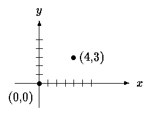
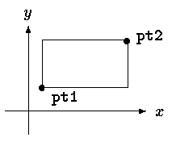
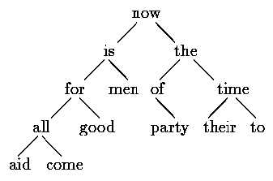
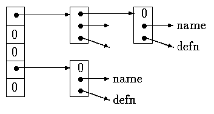

## 第6章 结构

结构是一个或多个变量的集合，这些变量可能为不同的类型，为了处理的方便而将这些变量组织在一个名字之下。（某些语言将结构称为“记录”，比如 Pascal 语言。）由于结构将一组相关的变量看作一个单元而不是各自独立的实体，因此结构有助于组织复杂的数据，特别是在大型的程序中。

工资记录是用来描述结构的一个传统例子。每个雇员由一组属性描述，如姓名、地址、社会保险号、工资等。其中的某些属性也可以是结构，例如姓名可以分成几部分，地址甚至工资也可能出现类似的情况。C 语言中更典型的一个例子来自于图形领域：点由一对坐标定义，矩形由两个点定义，等等。

ANSI 标准在结构方面最主要的变化是定义了结构的赋值操作——结构可以拷贝、赋值、传递给函数，函数也可以返回结构类型的返回值。多年以前，这一操作就已经被大多数的编译器所支持，但是，直到这一标准才对其属性进行了精确定义。在 ANSI 标准中，自动结构和数组现在也可以进行初始化。

### 6.1.	结构的基本知识

我们首先来建立一些适用于图形领域的结构。点是最基本的对象，假定用 x 与 y 坐标表示它，且 x、y 的坐标值都为整数（参见图 6-1）



图 6-1

我们可以采用结构存放这两个坐标，其声明如下：
```c
struct point {
    int x;
    int y;
};
```
关键字 struct 引入结构声明。结构声明由包含在花括号内的一系列声明组成。关键字 struct 后面的名字是可选的，称为结构标记（这里是 point）。结构标记用于为结构命名，在定义之后，结构标记就代表花括号内的声明，可以用它作为该声明的简写形式。

结构中定义的变量称为成员。结构成员、结构标记和普通变量（即非成员）可以采用相同的名字，它们之间不会冲突，因为通过上下文分析总可以对它们进行区分。另外，不同结构中的成员可以使用相同的名字，但是，从编程风格方面来说，通常只有密切相关的对象才会使用相同的名字。

struct 声明定义了一种数据类型。在标志结构成员表结束的右花括号之后可以跟一个变量表，这与其它基本类型的变量声明是相同的。例如：
```c
struct { ... } x, y, z;
```
从语法角度来说，这种方式的声明与声明
```c
int x, y, z;
```
具有类似的意义。这两个声明都将 x、y 与 z 声明为指定类型的变量，并且为它们分配存储空间。

如果结构声明的后面不带变量表，则不需要为它分配存储空间，它仅仅描述了一个结构的模板或轮廓。但是，如果结构声明中带有标记，那么在以后定义结构实例时便可以使用该标记定义。例如，对于上面给出的结构声明 point，语句
```c
struct point pt;
```
定义了一个 struct point 类型的变量 pt。结构的初始化可以在定义的后面使用初值表进行。初值表中同每个成员对应的初值必须是常量表达式，例如：
```c
struct point maxpt = {320, 200};
```
自动结构也可以通过赋值初始化，还可以通过调用返回相应类型结构的函数进行初始化。

在表达式中，可以通过下列形式引用某个特定结构中的成员：
```
结构名.成员
```
其中的结构成员运算符“.”将结构名与成员名连接起来。例如，可用下列语句打印点 pt 的坐标：
```c
printf("%d,%d", pt.x, pt.y);
```
或者通过下列代码计算原点(0, 0)到点 pt 的距离：
```c
double dist, sqrt(double);
dist = sqrt((double)pt.x * pt.x + (double)pt.y * pt.y);
```
结构可以嵌套。我们可以用对角线上的两个点来定义矩形（参见图 6-2），相应的结构定
义如下：



图 6-2

```c
struct rect {
    struct point pt1;
    struct point pt2;
};
```
结构 rect 包含两个 point 类型的成员。如果按照下列方式声明 screen 变量：
```c
struct rect screen;
```
则可以用语句
```c
screen.pt1.x
```
引用 screen 的成员 pt1 的 x 坐标。

### 6.2.	结构与函数

结构的合法操作只有几种：作为一个整体复制和赋值，通过&运算符取地址，访问其成员。其中，复制和赋值包括向函数传递参数以及从函数返回值。结构之间不可以进行比较。可以用一个常量成员值列表初始化结构，自动结构也可以通过赋值进行初始化。

为了更进一步地理解结构，我们编写几个对点和矩形进行操作的函数。至少可以通过 3 种可能的方法传递结构：一是分别传递各个结构成员，二是传递整个结构，三是传递指向结构的指针。这 3 种方法各有利弊。

首先来看一下函数 makepoint，它带有两个整型参数，并返回一个 point 类型的结构：
```c
/* makepoint:  make a point from x and y components */
struct point makepoint(int x, int y)
{
	struct point temp;

	temp.x = x;
	temp.y = y;
	return temp;
}
```
注意，参数名和结构成员同名不会引起冲突。事实上，使用重名可以强调两者之间的关系。

现在可以使用 makepoint 函数动态地初始化任意结构，也可以向函数提供结构类型的参数。例如：
```c
struct rect screen;
struct point middle;
struct point makepoint(int, int);

screen.pt1 = makepoint(0, 0);
screen.pt2 = makepoint(XMAX, YMAX);
middle = makepoint((screen.pt1.x + screen.pt2.x)/2,
                   (screen.pt1.y + screen.pt2.y)/2);
```
接下来需要编写一系列的函数对点执行算术运算。例如：
```c
/* addpoint:  add two points */
struct point addpoint(struct point p1, struct point p2)
{
	p1.x += p2.x;
	p1.y += p2.y;
	return p1;
}
```
其中，函数的参数和返回值都是结构类型。之所以直接将相加所得的结果赋值给 p1，而没有使用显式的临时变量存储，是为了强调结构类型的参数和其它类型的参数一样，都是通过值传递的。

下面来看另外一个例子。函数 prinrect 判断一个点是否在给定的矩形内部。我们采用这样一个约定：矩形包括其左侧边和底边，但不包括顶边和右侧边。
```c
/* ptinrect:  return 1 if p in r, 0 if not */
int ptinrect(struct point p, struct rect r)
{
    return p.x >= r.pt1.x && p.x < r.pt2.x
        && p.y >= r.pt1.y && p.y < r.pt2.y;
}
```
这里假设矩形是用标准形式表示的，其中 pt1 的坐标小于 pt2 的坐标。下列函数将返回一个规范形式的矩形：
```c
#define min(a, b) ((a) < (b) ? (a) : (b))
#define max(a, b) ((a) > (b) ? (a) : (b))

/* canonrect:  canonicalize coordinates of rectangle */
struct rect canonrect(struct rect r)
{
	struct rect temp;

	temp.pt1.x = min(r.pt1.x, r.pt2.x);
	temp.pt1.y = min(r.pt1.y, r.pt2.y);
	temp.pt2.x = max(r.pt1.x, r.pt2.x);
	temp.pt2.y = max(r.pt1.y, r.pt2.y);
	return temp;
}
```
如果传递给函数的结构很大，使用指针方式的效率通常比复制整个结构的效率要高。结构指针类似于普通变量指针。声明
```c
struct point *pp;
```
将 pp 定义为一个指向 struct point 类型对象的指针。如果 pp 指向一个 point 结构，那么\*pp 即为该结构，而(\*pp).x 和(\*pp).y 则是结构成员。可以按照下例中的方式使用 pp：
```c
struct point origin, *pp;
pp = &origin;
printf("origin is (%d,%d)\n", (*pp).x, (*pp).y);
```
其中，(\*pp).x 中的圆括号是必需的，因为结构成员运算符“.”的优先级比“\*”的优先级高。表达式\*pp.x 的含义等价于\*(pp.x)，因为 x 不是指针，所以该表达式是非法的。

结构指针的使用频度非常高，为了使用方便，C 语言提供了另一种简写方式。假定 p 是一个指向结构的指针，可以用
```
p->结构成员
```
这种形式引用相应的结构成员。这样，就可以用下面的形式改写上面的一行代码：
```c
printf("origin is (%d,%d)\n", pp->x, pp->y);
```
运算符.和->都是从左至右结合的，所以，对于下面的声明：
```c
struct rect r, *rp = &r;
```
以下 4 个表达式是等价的：
```c
r.pt1.x
rp->pt1.x
(r.pt1).x
(rp->pt1).x
```
在所有运算符中，下面 4 个运算符的优先级最高：结构运算符“.”和“->”、用于函数调用的“()”以及用于下标的“[]”，因此，它们同操作数之间的结合也最紧密。例如，对于结构声明
```c
struct {
    int len;
    char *str;
} *p;
```
表达式
```c
++p->len
```
将增加 len 的值，而不是增加 p 的值，这是田为，其中的隐含括号关系是++(p->len)。可以使用括号改变结合次序。例如：(++p)->len 将先执行 p 的加 1 操作，再对 len 执行操作；而(p++)->len 则先对 len 执行操作，然后再将 p 加 1（该表达式中的括号可以省略）。

同样的道理，\*p->str 读取的是指针 str 所指向的对象的值；\*p->str++先读取指针 str 指向的对象的值，然后再将 str 加 1（与\*s++相同）；(\*p->str）++将指针 str 指向的对象的值加 1；\*p++->str 先读取指针 str 指向的对象的值，然后再将 p 加 1。

### 6.3.	结构数组

考虑编写这样一个程序，它用来统计输入中各个 C 语言关键字出现的次数。我们需要用一个字符串数组存放关键字名，一个整型数组存放相应关键字的出现次数。一种实现方法是，使用两个独立的数组 keyword 和 keycount 分别存放它们，如下所示
```c
char *keyword[NKEYS];
int keycount[NKEYS];
```
我们注意到，这两个数组的大小相同，考虑到该特点，可以采用另一种不同的组织方式，也就是我们这里所说的结构数组。每个关键字项包括一对变量：
```c
char *word; int cout;
```
这样的多个变量对共同构成一个数组。我们来看下面的声明：
```c
struct key {
  char *word;
  int count;
} keytab[NKEYS];
```
它声明了一个结构类型 key，并定义了该类型的结构数组 keytab，同时为其分配存储空间。数组 keytab 的每个元素都是一个结构。上述声明也可以写成下列形式：
```c
struct key {
  char *word;
  int count;
};

struct key keytab[NKEYS];
```
因为结构 keytab 包含一个固定的名字集合，所以，最好将它声明为外部变量，这样，只需要初始化一次，所有的地方都可以使用。这种结构的初始化方法同前面所述的初始化方法类似——在定义的后面通过一个用圆括号括起来的初值表进行初始化，如下所示：
```c
struct key {
    char *word;
    int count;
} keytab[] = {
    "auto", 0,
    "break", 0,
    "case", 0,
    "char", 0,
    "const", 0,
    "continue", 0,
    "default", 0,
    /* ... */
    "unsigned", 0,
    "void", 0,
    "volatile", 0,
    "while", 0
};
```
与结构成员相对应，初值也要按照成对的方式列出。更精确的做法是，将每一行（即每个结构）的初值都括在花括号内，如下所示：
```c
{ "auto", 0 },
{ "break", 0 },
{ "case", 0 },
...
```
但是，如果初值是简单变量或字符串，并且其中的任何值都不为空，则内层的花括号可以省略。通常情况下，如果初值存在并且方括号[ ]中没有数值，编译程序将计算数组 keytab 中 的项数。

在统计关键字出现次数的程序中，我们首先定义了 keytab。主程序反复调用函数 getword 读取输入，每次读取一个单词。每个单词将通过折半查找函数（参见第 3 章）在 keytab 中进行查找。注意，关键字列表必须按升序存储在 keytab 中。
```c
#include <stdio.h>
#include <ctype.h>
#include <string.h>

#define	MAXWORD	100

int getword(char *, int);
int binsearch(char *, struct key *, int);

/* count C keywords */
main()
{
    int n;
    char word[MAXWORD];

    while (getword(word, MAXWORD) != EOF)
        if (isalpha(word[0]))
            if ((n = binsearch(word, keytab, NKEYS)) >= 0)
                keytab[n].count++;
    for (n = 0; n < NKEYS; n++)
        if (keytab[n].count > 0)
            printf("%4d %s\n",
                keytab[n].count, keytab[n].word);
    return 0;
}

/* binsearch:  find word in tab[0]...tab[n-1] */
int binsearch(char *word, struct key tab[], int n)
{
    int cond;
    int low, high, mid;

    low = 0;
    high = n - 1;
    while (low <= high) {
        mid = (low+high) / 2;
        if ((cond = strcmp(word, tab[mid].word)) < 0)
            high = mid - 1;
        else if (cond > 0)
            low = mid + 1;
        else
            return mid;
    }
    return -1;
}
```
函数 getword 将在稍后介绍，这里只需要了解它的功能是每调用一次该函数，将读入一个单词，并将其复制到名字为该函数的第一个参数的数组中。

NKEYS 代表 keytab 中关键字的个数。尽管可以手工计算，但由机器实现会更简单、更安全，当列表可能变更时尤其如此。一种解决办法是，在初值表的结尾处加上一个空指针，然后循环遍历 keytab，直到读到尾部的空指针为止。

但实际上并不需要这样做，因为数组的长度在编译时已经完全确定，它等于数组项的长度乘以项数，因此，可以得出项数为：
```
Keytab 的长度/struct key 的长度
```
C 语言提供了一个编译时（compile-time）一元运算符 sizeof，它可用来计算任一对象的长度。表达式
```c
sizeof 对象
```
以及
```c
sizeof(类型名)
```
将返回一个整型值，它等于指定对象或类型占用的存储空间字节数。（严格地说，sizeof 的返回值是无符号整型值，其类型为 size_t，该类型在头文件`<stddef.h>`中定义。）其中，对象可以是变量、数组或结构；类型可以是基本类型，如 int、double，也可以是派生类型，如结构类型或指针类型。

在该例子中，关键字的个数等于数组的长度除以单个元素的长度。下面的#define 语句使用了这种方法设置 NKEYS 的值：
```c
#define NKEYS (sizeof keytab / sizeof(struct key))
```
另一种方法是用数组的长度除以一个指定元素的长度，如下所示：
```c
#define NKEYS (sizeof keytab / sizeof(keytab[0]))
```
使用第二种方法，即使类型改变了，也不需要改动程序。

条件编译语句#if 中不能使用 sizeof，因为预处理器不对类型名进行分析。但预处理器并不计算#define 语句中的表达式，因此，在#define 中使用 sizeof 是合法的。

下面来讨论函数 getword。我们这里给出一个更通用的 getword 函数。该函数的功能已超出这个示例程序的要求，不过，函数本身并不复杂。getword 从输入中读取下一个单词，单词可以是以字母开头的字母和数字串，也可以是一个非空白符字符。函数返回值可能是单词的第一个字符、文件结束符 EOF 或字符本身（如果该字符不是字母字符的话）。
```c
/* getword:  get next word or character from input */
int getword(char *word, int lim)
{
    int c, getch(void);
    void ungetch(int);
    char *w = word;

    while (isspace(c = getch()))
        ;
    if (c != EOF)
        *w++ = c;
    if (!isalpha(c)) {
        *w = '\0';
        return c;
    }
    for ( ; --lim > 0; w++)
        if (!isalnum(*w = getch())) {
            ungetch(*w);
            break;
        }
    *w = '\0';
    return word[0];
}
```
getword 函数使用了第 4 章中的函数 getch 和 ungetch。当读入的字符不属于字母数字的集合时，说明 getword 多读入了一个字符。随后，调用 ungetch 将多读的一个字符放回到输入中，以便下一次调用使用。Getword 还使用了其它一些函数：isspace 函数跳过空白符，isalpha 函数识别字母，isalnum 函数识别字母和数字。所有这些函数都定义在标准头文件`<ctype.h>`中。

**练习 6-1**	上述 getword 函数不能正确处理下划线、字符串常量、注释及预处理器控制指令。请编写一个更完善的 getword 函数。

### 6.4.	指向结构的指针

为了进一步说明指向结构的指针和结构数组，我们重新编写关键字统计程序，这次采用指针，而不使用数组下标。

keytab 的外部声明不需要修改，但 main 和 binsearch 函数必须修改。修改后的程序如下：
```c
#include <stdio.h>
#include <ctype.h>
#include <string.h>
#define MAXWORD 100

int getword(char *, int);
struct key *binsearch(char *, struct key *, int);

/* count C keywords; pointer version */
main()
{
    char word[MAXWORD];
    struct key *p;

    while (getword(word, MAXWORD) != EOF)
        if (isalpha(word[0]))
            if ((p=binsearch(word, keytab, NKEYS)) != NULL)
                p->count++;
    for (p = keytab; p < keytab + NKEYS; p++)
        if (p->count > 0)
            printf("%4d %s\n", p->count, p->word);
    return 0;
}

/* binsearch:  find word in tab[0]...tab[n-1] */
struct key *binsearch(char *word, struct key *tab, int n)
{
    int cond;
    struct key *low = &tab[0];
    struct key *high = &tab[n];
    struct key *mid;

    while (low < high) {
        mid = low + (high-low) / 2;
        if ((cond = strcmp(word, mid->word)) < 0)
            high = mid;
        else if (cond > 0)
            low = mid + 1;
        else
            return mid;
    }
    return NULL;
}
```
这里需要注意几点。首先，binsearch 函数在声明中必须表明：它返回的值类型是一个指向 struct key 类型的指针，而非整型，这在函数原型及 binsearch 函数中都要声明。如果 binsearch 找到与输入单词匹配的数组元素，它将返回一个指向该元素的指针，否则返回 NULL。

其次，keytab 的元素在这里是通过指针访问的。这就需要对 binsearch 做较大的修改。在这里，low 和 high 的初值分别是指向表头元素的指针和指向表尾元素后面的一个元素的指针。

这样，我们就无法简单地通过下列表达式计算中间元素的位置：
```c
mid = (low+high) / 2	/* WRONG */
```
这是因为，两个指针之间的加法运算是非法的。但是，指针的减法运算却是合法的，high-low的值就是数组元素的个数，因此，可以用下列表达式：
```c
mid = low + (high-low) / 2
```
将 mid 设置为指向位于 high 和 low 之间的中间元素的指针。

对算法的最重要修改在于，要确保不会生成非法的指针，或者是试图访问数组范围之外的元素。问题在于，&tab[-1]和&tab[n]都超出了数组 tab 的范围。前者是绝对非法的，而对后者的间接引用也是非法的。但是，C 语言的定义保证数组末尾之后的第一个元素（即&tab[n]）的指针算术运算可以正确执行。

主程序 main 中有下列语句：
```c
for (p = keytab; p < keytab + NKEYS; p++)
```
如果 p 是指向结构的指针，则对 p 的算术运算需要考虑结构的长度，所以，表达式 p++执行时，将在 p 的基础上加上一个正确的值，以确保得到结构数组的下一个元素，这样，上述测试条件便可以保证循环正确终止。

但是，千万不要认为结构的长度等于各成员长度的和。因为不同的对象有不同的对齐要求，所以，结构中可能会出现未命名的“空穴“（hole）。例如，假设 char 类型占用一个字节， int 类型占用 4 个字节，则下列结构：
```c
struct {
    char c;
    int i;
};
```
可能需要 8 个字节的存储空间，而不是 5 个字节。使用 sizeof 运算符可以返回正确的对象 长度。

最后，说明一点程序的格式问题：当函数的返回值类型比较复杂时（如结构指针），例如
```c
struct key *binsearch(char *word, struct key *tab, int n)
```
很难看出函数名，也不太容易使用文本编辑器找到函数名。我们可以采用另一种格式书写上述语句：
```c
struct key *
binsearch(char *word, struct key *tab, int n)
```
具体采用哪种写法属于个人的习惯问题，可以选择自己喜欢的方式并始终保持自己的风格。

### 6.5.     自引用结构

假定我们需要处理一个更一般化的问题：统计输入中所有单词的出现次数。因为预先不知道出现的单词列表，所以无法方便地排序，并使用折半查找；也不能分别对输入中的每个单词都执行一次线性查找，看它在前面是否已经出现，这样做，程序的执行将花费太长的时间。（更准确地说，程序的执行时间是与输入单词数目的二次方成比例的。）我们该如何组织这些数据，才能够有效地处理一系列任意的单词呢？

一种解决方法是，在读取输入中任意单词的同时，就将它放置到正确的位置，从而始终保证所有单词是按顺序排列的。虽然这可以不用通过在线性数组中移动单词来实现，但它仍然会导致程序执行的时间过长。我们可以使用一种称为二叉树的数据结构来取而代之。

每个不同的单词在树中都是一个节点，每个节点包含：

-	一个指向该单词内容的指针
-	一个统计出现次数的计数值
-	一个指向左子树的指针
-	一个指向右子树的指针

任何节点最多拥有两个子树，也可能只有一个子树或一个都没有。

对节点的所有操作要保证，任何节点的左子树只包含按字典序小于该节点中单词的那些单词，右子树只包含按字典序大于该节点中单词的那些单词。图 6-3 是按序插入句子“now is the time for all good men to come to the aid of their party”中各单词后生成的树。



图 6-3

要查找一个新单词是否已经在树中，可以从根节点开始，比较新单词与该节点中的单词。若匹配，则得到肯定的答案。若新单词小于该节点中的单词，则在左子树中继续查找，否则在右子树中查找。如在搜寻方向上无子树，则说明新单词不在树中，并且，当前的空位置就是存放新加入单词的正确位置。因为从任意节点出发的查找都要按照同样的方式查找它的一个子树，所以该过程是递归的。相应地，在插入和打印操作中使用递归过程也是很自然的事情。

我们再来看节点的描述问题。最方便的表示方法是表示为包括 4 个成员的结构：
```c
struct tnode {        /* the tree node: */
    char *word;           /* points to the text */
    int	count;            /* number of occurrences */
    struct tnode *left;   /* left child */
    struct tnode *right;  /* right child */
};
```
这种对节点的递归的声明方式看上去好像是不确定的，但它的确是正确的。一个包含其自身实例的结构是非法的，但是，下列声明是合法的：
```c
struct tnode *left;
```
它将 left 声明为指向 tnode 的指针，而不是 tnode 实例本身。

我们偶尔也会使用自引用结构的一种变体：两个结构相互引用。具体的使用方法如下：
```c
struct t {
  ...
  struct s *p;	/* p points to an s */
};
struct s {
  ...
  struct t *q;	/* q points to a t */
};
```
如下所示，整个程序的代码非常短小。当然，它需要我们前面编写的一些程序的支持，比如 getword 等。主函数通过 getword 读入单词，并通过 addtree 函数将它们插入到树中。
```c
#include <stdio.h>
#include <ctype.h>
#include <string.h>

#define MAXWORD 100
struct tnode *addtree(struct tnode *, char *);
void treeprint(struct tnode *);
int getword(char *, int);

/* word frequency count */
main()
{
    struct tnode *root;
    char word[MAXWORD];

    root = NULL;
    while (getword(word, MAXWORD) != EOF)
        if (isalpha(word[0]))
            root = addtree(root, word);
    treeprint(root);
    return 0;
}
```
函数 addtree 是递归的。主函数 main 以参数的方式传递给该函数的一个单词将作为树的最顶层（即树的根）。在每一步中，新单词与节点中存储的单词进行比较，随后，通过递归调用 addtree 而转向左子树或右子树。该单词最终将与树中的某节点匹配（这种情况下计数值加 1），或遇到一个空指针（表明必须创建一个节点并加入到树中）。若生成了新节点，则 addtree 返回一个指向新节点的指针，该指针保存在父节点中。
```c
struct tnode *talloc(void);
char *strdup(char *);

/* addtree:  add a node with w, at or below p */
struct tnode *addtree(struct tnode *p, char *w)
{
    int cond;

    if (p == NULL) {    /* a new word has arrived */
        p = talloc();   /* make a new node */
        p->word = strdup(w);
        p->count = 1;
        p->left = p->right = NULL;
    } else if ((cond = strcmp(w, p->word)) == 0)
        p->count++;     /* repeated word */
    else if (cond < 0)  /* less than into left subtree */
        p->left = addtree(p->left, w);
    else            /* greater than into right subtree */
        p->right = addtree(p->right, w);
    return p;
}
```
新节点的存储空间由子程序 talloc 获得。talloc 函数返回一个指针，指向能容纳一个树节点的空闲空间。函数 strdup 将新单词复制到某个隐藏位置（稍后将讨论这些子程序）。计数值将被初始化，两个子树被置为空（NULL）。增加新节点时，这部分代码只在树叶部分执行。该程序忽略了对 strdup 和 talloc 返回值的出错检查（这显然是不完善的）。

treeprint 函数按顺序打印树。在每个节点，它先打印左子树（小于该单词的所有单词），然后是该单词本身，最后是右子树（大于该单词的所有单词）。如果你对递归操作有些疑惑的话，不妨在上面的树中模拟 treeprint 的执行过程。
```c
/* treeprint:  in-order print of tree p */
void treeprint(struct tnode *p)
{
    if (p != NULL) {
        treeprint(p->left);
        printf("%4d %s\n", p->count, p->word);
        treeprint(p->right);
    }
}
```
这里有一点值得注意：如果单词不是按照随机的顺序到达的，树将变得不平衡，这种情况下，程序的运行时间将大大增加。最坏的情况下，若单词已经排好序，则程序模拟线性查找的开销将非常大。某些广义二叉树不受这种最坏情况的影响，在此我们不讨论。

在结束该例子之前，我们简单讨论一下有关存储分配程序的问题。尽管存储分配程序需要为不同的对象分配存储空间，但显然，程序中只会有一个存储分配程序。但是，假定用一个分配程序来处理多种类型的请求，比如指向 char 类型的指针和指向 struct tnode 类型的指针，则会出现两个问题。第一，它如何在大多数实际机器上满足各种类型对象的对齐要求（例如，整型通常必须分配在偶数地址上），第二，使用什么样的声明能处理分配程序必须能返回不同类型的指针的问题？

对齐要求一般比较容易满足，只需要确保分配程序始终返回满足所有对齐限制要求的指针就可以了，其代价是牺牲一些存储空间。第 5 章介绍的 alloc 函数不保证任何特定类型的对齐，所以，我们使用标准库函数 malloc，它能够满足对齐要求。第 8 章将介绍实现 malloc 函数的一种方法。

对于任何执行严格类型检查的语言来说，像 malloc 这样的函数的类型声明总是很令人头疼的问题。在 C 语言中，一种合适的方法是将 malloc 的返回值声明为一个指向 void 类型的指针，然后再显式地将该指针强制转换为所需类型。malloc 及相关函数声明在标准头文 件`<stdlib.h>`中。因此，可以把 talloc 函数写成下列形式：
```c
#include <stdlib.h>

/* talloc:  make a tnode */
struct tnode *talloc(void)
{
    return (struct tnode *) malloc(sizeof(struct tnode));
}
```
strdup 函数只是把通过其参数传入的字符串复制到某个安全的位置。它是通过调用 malloc 函数实现的：
```c
char *strdup(char *s)   /* make a duplicate of s */
{
	char *p;

	p = (char *) malloc(strlen(s)+1);  /* +1 for '\0' */
	if (p != NULL)
		strcpy(p, s);
	return p;
}
```
在没有可用空间时，malloc 函数返回 NULL，同时，strdup 函数也将返回 NULL，strdup函数的调用者负责出错处理。

调用 malloc 函数得到的存储空间可以通过调用 free 函数释放以重用。详细信息请参见第 7 章和第 8 章。

**练习 6-2** 编写一个程序，用以读入一个 C 语言程序，并按字母表顺序分组打印变量名，要求每一组内各变量名的前 6 个字符相同，其余字符不同。字符串和注释中的单词不予考虑。 请将 6 作为一个可在命令行中设定的参数。

**练习 6-3**	编写一个交叉引用程序，打印文档中所有单词的列表，并且每个单词还有一个列表，记录出现过该单词的行号。对 the、and 等非实义单词不予考虑。

**练习 6-4**	编写一个程序，根据单词的出现频率按降序打印输入的各个不同单词，并在每个单词的前面标上它的出现次数。

### 6.6.	表查找

为了对结构的更多方面进行深入的讨论，我们来编写一个表查找程序包的核心部分代码。这段代码很典型，可以在宏处理器或编译器的符号表管理例程中找到。例如，考虑#define 语句。当遇到类似于
```c
#define	IN 1
```
之类的程序行时，就需要把名字 IN 和替换文本 1 存入到某个表中。此后，当名字 IN 出现在某些语句中时，如：
```c
statet = IN;
```
就必须用 1 来替换 IN。

以下两个函数用来处理名字和替换文本。install(s, t)函数将名字 s 和替换文本 t 记录到某个表中，其中 s 和 t 仅仅是字符串。lookup(s)函数在表中查找 s，若找到，则返回指向该处的指针；若没找到，则返回 NULL。

该算法采用的是散列查找方法——将输入的名字转换为一个小的非负整数，该整数随后将作为一个指针数组的下标。数组的每个元素指向某个链表的表头，链表中的各个块用于描述具有该散列值的名字。如果没有名字散列到该值，则数组元素的值为 NULL（参见图 6-4）。



图 6-4

链表中的每个块都是一个结构，它包含一个指向名字的指针、一个指向替换文本的指针以及一个指向该链表后继块的指针。如果指向链表后继块的指针为 NULL，则表明链表结束。
```c
struct nlist {       /* table entry: */
    struct nlist *next;   /* next entry in chain */
    char *name;           /* defined name */
    char *defn;           /* replacement text */
};
```
相应的指针数组定义如下：
```c
#define HASHSIZE 101
static struct nlist *hashtab[HASHSIZE];	/* pointer table */
```
散列函数 hash 在 lookup 和 install 函数中都被用到，它通过一个 for 循环进行计算，每次循环中，它将上一次循环中计算得到的结果值经过变换（即乘以 31）后得到的新值同字符串中当前字符的值相加(\*s + 31 \* hashval)，然后将该结果值同数组长度执行取模操作，其结果即是该函数的返回值。这并不是最好的散列函数，但比较简短有效。
```c
/* hash:  form hash value for string s */
unsigned hash(char *s)
{
    unsigned hashval;

    for (hashval = 0; *s != '\0'; s++)
        hashval = *s + 31 * hashval;
    return hashval % HASHSIZE;
}
```
由于在散列计算时采用的是无符号算术运算，因此保证了散列值非负。

散列过程生成了在数组 hashtab 中执行查找的起始下标。如果该字符串可以被查找到，则它一定位于该起始下标指向的链表的某个块中。具体查找过程由 lookup 函数实现。如果lookup 函数发现表项已存在，则返回指向该表项的指针，否则返回 NULL。
```c
/* lookup:  look for s in hashtab */
struct nlist *lookup(char *s)
{
    struct nlist *np;

    for (np = hashtab[hash(s)]; np != NULL; np = np->next)
        if (strcmp(s, np->name) == 0)
            return np;  /* found */
    return NULL;        /* not found */
}
```
lookup 函数中的 for 循环是遍历一个链表的标准方法，如下所示：
```c
for (ptr = head; ptr != NULL; ptr = ptr->next)
...
```
install 函数借助 lookup 函数判断待加入的名字是否已经存在。如果已存在，则用新的定义取而代之；否则，创建一个新表项。如无足够空间创建新表项，则 install 函数返回 NULL。
```c
struct nlist *lookup(char *);
char *strdup(char *);

/* install:  put (name, defn) in hashtab */
struct nlist *install(char *name, char *defn)
{
    struct nlist *np;
    unsigned hashval;

    if ((np = lookup(name)) == NULL) {  /* not found */
        np = (struct nlist *) malloc(sizeof(*np));
        if (np == NULL || (np->name = strdup(name)) == NULL)
            return NULL;
        hashval = hash(name);
        np->next = hashtab[hashval];
        hashtab[hashval] = np;
    } else      /* already there */
        free((void *) np->defn);  /* free previous defn */
    if ((np->defn = strdup(defn)) == NULL)
        return NULL;
    return np;
}
```
**练习 6-5**	编写函数 undef，它将从由 lookup 和 install 维护的表中删除一个变量及其定义。

**练习 6-6**	以本节介绍的函数为基础，编写一个适合 C 语言程序使用的#define 处理器的简单版本（即无参数的情况）。你会发现 getch 和 ungetch 函数非常有用。

### 6.7.	类型定义（typedef）

C 语言提供了一个称为 typedef 的功能，它用来建立新的数据类型名，例如，声明
```c
typedef int Length;
```
将 Length 定义为与 int 具有同等意义的名字。类型 Length 可用于类型声明、类型转换等，它和类型 int 完全相同，例如：
```c
Length len, maxlen;
Length *lengths[];
```
类似地，声明
```c
typedef char* String；
```
将 String 定义为与 char \*或字符指针同义，此后，便可以在类型声明和类型转换中使用 String，例如：
```c
String p, lineptr[MAXLINES], alloc(int);
int strcmp(String, String);
p = (String) malloc(100);
```
注意，typedef 中声明的类型在变量名的位置出现，而不是紧接在关键字 typedef 之 后。typedef 在语法上类似于存储类 extern、static 等。我们在这里以大写字母作为 typedef 定义的类型名的首字母，以示区别。

这里举一个更复杂的例子：用 typedef 定义本章前面介绍的树节点。如下所示：
```c
typedef struct tnode *Treeptr;

typedef struct tnode {   /* the tree node: */
    char *word;              /* points to the text */
    int count;               /* number of occurrences */
    Treeptr left;            /* left child */
    Treeptr right;           /* right child */
} Treenode;
```
上述类型定义创建了两个新类型关键字：Treenode（一个结构）和 Treeptr（一个指向该结构的指针）。这样，函数 talloc 可相应地修改为：
```c
Treeptr talloc(void)
{
    return (Treeptr) malloc(sizeof(Treenode));
}
```
这里必须强调的是，从任何意义上讲，typedef 声明并没有创建一个新类型，它只是为某个已存在的类型增加了一个新的名称而已。typedef 声明也没有增加任何新的语义：通过这种方式声明的变量与通过普通声明方式声明的变量具有完全相同的属性。实际上，typedef 类似于#define 语句，但由于 typedef 是由编译器解释的，因此它的文本替换功能要超过预处理器的能力。例如：
```c
typedef int (*PFI)(char *, char *);
```
该语句定义了类型 PFI 是“一个指向函数的指针，该函数具有两个 char \*类型的参数，返回值类型为 int”，它可用于某些上下文中，例如，可以用在第 5 章的排序程序中，如下所示：
```c
PFI strcmp, numcmp;
```
除了表达方式更简洁之外，使用 typedef 还有另外两个重要原因。首先，它可以使程序参数化，以提高程序的可移植性。如果 typedef 声明的数据类型同机器有关，那么，当程序移植到其它机器上时，只需改变 typedef 类型定义就可以了。一个经常用到的情况是，对于各种不同大小的整型值来说，都使用通过 typedef 定义的类型名，然后，分别为各个不同的宿主机选择一组合适的 short、int 和 long 类型大小即可。标准库中有一些例子，例如 size_t 和 ptrdiff_t 等。

typedef 的第二个作用是为程序提供更好的说明性——Treeptr 类型显然比一个声明为指向复杂结构的指针更容易让人理解。

### 6.8.     联合

联合是可以（在不同时刻）保存不同类型和长度的对象的变量，编译器负责跟踪对象的长度和对齐要求。联合提供了一种方式，以在单块存储区中管理不同类型的数据，而不需要在程序中嵌入任何同机器有关的信息。它类似于 Pascal 语言中的变体记录。

我们来看一个例子（可以在编译器的符号表管理程序中找到该例子）。假设一个常量可能是 int、f1oat 或字符指针。特定类型的常量值必须保存在合适类型的变量中，然而，如果该常量的不同类型占据相同大小的存储空间，且保存在同一个地方的话，表管理将最方便。这就是联合的目的——一个变量可以合法地保存多种数据类型中任何一种类型的对象。其语法基于结构，如下所示：
```c
union u_tag {
    int ival;
    float fval;
    char *sval;
} u;
```
变量 u 必须足够大，以保存这 3 种类型中最大的一种，具体长度同具体的实现有关。这些类型中的任何一种类型的对象都可赋值给 u，且可使用在随后的表达式中，但必须保证是一致的：读取的类型必须是最近一次存入的类型。程序员负责跟踪当前保存在联合中的类型。如果保存的类型与读取的类型不一致，其结果取决于具体的实现。

可以通过下列语法访问联合中的成员：
```
联合名.成员
```
或
```
联合指针->成员
```
它与访问结构的方式相同。如果用变量 utype 跟踪保存在 u 中的当前数据类型，则可以像下面这样使用联合：
```c
if (utype == INT)
    printf("%d\n", u.ival);
if (utype == FLOAT)
    printf("%f\n", u.fval);
if (utype == STRING)
    printf("%s\n", u.sval);
else
   printf("bad type %d in utype\n", utype);
```
联合可以使用在结构和数组中，反之亦可。访问结构中的联合（或反之）的某一成员的表示法与嵌套结构相同。例如，假定有下列的结构数组定义：
```c
struct {
    char *name;
    int flags;
    int utype;
    union {
        int ival;
        float fval;
        char *sval;
    } u;
} symtab[NSYM];
```
可以通过下列语句引用其成员 ival：
```c
symtab[i].u.ival
```
也可以通过下列语句之一引用字符串 sval 的第一个字符：
```c
*symtab[i].u.sval
symtab[i].u.sval[0]
```
实际上，联合就是一个结构，它的所有成员相对于基地址的偏移量都为 0，此结构空间要大到足够容纳最“宽”的成员，并且，其对齐方式要适合于联合中所有类型的成员。对联合允许的操作与对结构允许的操作相同：作为一个整体单元进行赋值、复制、取地址及访问其中一个成员。

联合只能用其第一个成员类型的值进行初始化，因此，上述联合 u 只能用整数值进行初始化。

第 8 章的存储分配程序将说明如何使用联合来强制一个变量在特定类型的存储边界上对齐。

### 6.9.	位字段

在存储空间很宝贵的情况下，有可能需要将多个对象保存在一个机器字中。一种常用的方法是，使用类似于编译器符号表的单个二进制位标志集合。外部强加的数据格式（如硬件 设备接口）也经常需要从字的部分值中读取数据。

考虑编译器中符号表操作的有关细节。程序中的每个标识符都有与之相关的特定信息，例如，它是否为关键字，它是否是外部的且（或）是静态的，等等。对这些信息进行编码的最简洁的方法就是使用一个 char 或 int 对象中的位标志集合。

通常采用的方法是，定义一个与相关位的位置对应的“屏蔽码”集合，如：
```c
#define KEYWORD	01
#define EXTRENAL 02
#define STATIC	04
```
或
```c
enum { KEYWORD = 01, EXTERNAL = 02, STATIC = 04 };
```
这些数字必须是 2 的幂。这样，访问这些位就变成了用第 2 章中描述的移位运算、屏蔽运算及补码运算进行简单的位操作。

下列语句在程序中经常出现：
```c
flags |= EXTERNAL | STATIC;
```
该语句将 flags 中的 EXTERNAL 和 STATIC 位置为 1，而下列语句：
```c
flags &= ~(EXTERNAL | STATIC);
```
则将它们置为 0。并且，当这两位都为 0 时，下列表达式：
```c
if ((flags & (EXTERNAL | STATIC)) == 0) ...
```
的值为真。

尽管这些方法很容易掌握，但是，C 语言仍然提供了另一种可替代的方法，即直接定义和访问一个字中的位字段的能力，而不需要通过按位逻辑运算符。位字段（bit-field），或简称字段，是“字”中相邻位的集合。“字”（word）是单个的存储单元，它同具体的实现有关。例如，上述符号表的多个#define 语句可用下列 3 个字段的定义来代替：

struct {
    unsigned int is_keyword : 1;
    unsigned int is_extern : 1;
    unsigned int is_static : 1;
} flags;
这里定义了一个变量 flags，它包含 3 个一位的字段。冒号后的数字表示字段的宽度（用二进制位数表示）。字段被声明为 unsigned int 类型，以保证它们是无符号量。

单个字段的引用方式与其它结构成员相同，例如 ： flags.is_keyword 、 flags.is_extern 等等。字段的作用与小整数相似。同其它整数一样，字段可出现在算术表达式中。因此，上面的例子可用更自然的方式表达为：
```c
flags.is_extern = flags.is_static = 1;
```
该语句将 is_extern 和 is_static 位置为 1。下列语句：
```c
flags.is_extern = flags.is_static = 0;
```
将 is_extern 和 is_static 位置为 0。下列语句：
```c
if (flags.is_extern == 0 && flags.is_static == 0)
...
```
用于对 is_extern 和 is_static 位进行测试。

字段的所有属性几乎都同具体的实现有关。字段是否能覆盖字边界由具体的实现定义。字段可以不命名，无名字段（只有一个冒号和宽度）起填充作用。特殊宽度 0 可以用来强制在下一个字边界上对齐。

某些机器上字段的分配是从字的左端至右端进行的，而某些机器上则相反。这意味着，尽管字段对维护内部定义的数据结构很有用，但在选择外部定义数据的情况下，必须仔细考虑哪端优先的问题。依赖于这些因素的程序是不可移植的。字段也可以仅仅声明为 int，为了方便移植，需要显式声明该 int 类型是 signed 还是 unsigned 类型。字段不是数组，并且没有地址，因此对它们不能使用 & 运算符。
