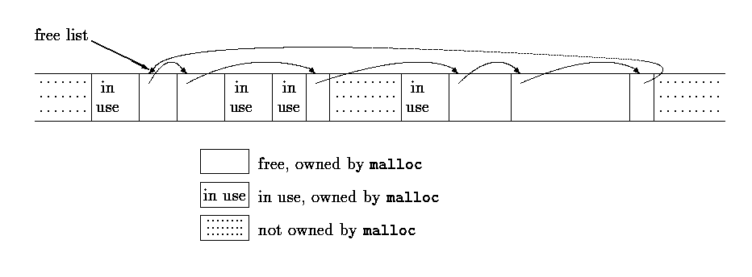
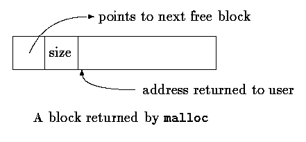

## 第8章 UNIX 系统接口

UNIX 操作系统通过一系列的系统调用提供服务，这些系统调用实际上是操作系统内的函数，它们可以被用户程序调用。本章将介绍如何在 C 语言程序中使用一些重要的系统调用。如果读者使用的是 UNIX，本章将会对你有直接的帮助，这是因为，我们经常需要借助于系统 调用以获得最高的效率，或者访问标准库中没有的某些功能。但是，即使读者是在其它操作系统上使用 C 语言，本章的例子也将会帮助你对 C 语言程序设计有更深入的了解。不同系统中的代码具有相似性，只是一些细节上有区别而已。因为 ANSI C 标准函数库是以 UNIX 系统为基础建立起来的，所以，学习本章中的程序还将有助于更好地理解标准库。

本章的内容包括 3 个主要部分，输入／输出、文件系统和存储分配。其中，前两部分的内容要求读者对 UNIX 系统的外部特性有一定的了解。

第 7 章介绍的输入／输出接口对任何操作系统都是一样的。在任何特定的系统中，标准库函数的实现必须通过宿主系统提供的功能来实现。接下来的几节将介绍 UNIX 系统中用于输入和输出的系统调用，并介绍如何通过它们实现标准库。

### 8.1.     文件描述符

在 UNIX 操作系统中，所有的外围设备（包括键盘和显示器）都被看作是文件系统中的文件，因此，所有的输入／输出都要通过读文件或写文件完成。也就是说，通过一个单一的接口就可以处理外围设备和程序之间的所有通信。

通常情况下，在读或写文件之前，必须先将这个意图通知系统，该过程称为打开文件。如果是写一个文件，则可能需要先创建该文件，也可能需要丢弃该文件中原先已存在的内容。系统检查你的权力（该文件是否存在？是否有访问它的权限？），如果一切正常，操作采统将 向程序返回一个小的非负整数，该整数称为文件描述符。任何时候对文件的输入／输出都是通过文件描述符标识文件，而不是通过文件名标识文件。（文件描述符类似于标准库中的文件指针或 MS-DOS 中的文件句柄。）系统负责维护已打开文件的所有信息，用户程序只能通过文件描述符引用文件。

因为大多数的输入／输出是通过键盘和显示器来实现的，为了方便起见，UNIX 对此做了特别的安排。当命令解释程序（即“shell”）运行一个程序的时候，它将打开 3 个文件，对应的文件描述符分别为 0，1，2，依次表示标准输入，标准输出和标准错误。如果程序从文件 0 中读，对 1 和 2 进行写，就可以进行输／输出而不必关心打开文件的问题。

程序的使用者可通过<和>重定向程序的 I/O：
```
prog < 输入文件名 > 输出文件名
```
这种情况下，shell 把文件描述符 0 和 1 的默认赋值改变为指定的文件。通常，文件描述符 2 仍与显示器相关联，这样，出错信息会输出到显示器上。与管道相关的输入／输出也有类似的特性。在任何情况下，文件赋值的改变都不是由程序完成的，而是由 shell 完成的。只要程序使用文件 0 作为输入，文件 1 和 2 作为输出，它就不会知道程序的输入从哪里来，并输出到哪里去。

### 8.2.	低级 I/O——read 和 write

输入与输出是通过 read 和 write 系统调用实现的。在 C 语言程序中，可以通过函数 read 和 write 访问这两个系统调用。这两个函数中，第一个参数是文件描述符，第二个参数是程序中存放读或写的数据的字符数组，第三个参数是要传输的字节数。
```c
int n_read = read(int fd, char *buf, int n);
int n_written = write(int fd, char *buf, int n);
```
每个调用返回实际传输的字节数。在读文件时，函数的返回值可能会小于请求的字节数。如果返回值为 0，则表示已到达文件的结尾；如果返回值为-1，则表示发生了某种错误。在写文件时，返回值是实际写入的字节数。如果返回值与请求写入的字节数不相等，则说明发生了错误。

在一次调用中，读出或写入的数据的字节数可以为任意大小。最常用的值为 1，即每次读 出或写入 1 个字符（无缓冲），或是类似于 1024～4096 这样的与外围设备的物理块大小相应的值。用更大的值调用该函数可以获得更高的效率，因为系统调用的次数减少了。

结合以上的讨论，我们可以编写一个简单的程序，将输入复制到输出，这与第 1 章中的复制程序在功能上相同。程序可以将任意输入复制到任意输出，因为输入／输出可以重定向 到任何文件或设备。
```c
#include "syscalls.h"

main()  /* copy input to output */
{
    char buf[BUFSIZ];
    int n;

    while ((n = read(0, buf, BUFSIZ)) > 0)
        write(1, buf, n);
    return 0;
}
```
我们已经将系统调用的函数原型集中放在一个头文件 syscalls.h 中，因此，本章中的程序都将包含该头文件。不过，该文件的名字不是标准的。

参数 BUFSIZ 也已经在 syscalls.h 头文件中定义。对于所使用的操作系统来说，该值是一个较合适的数值。如果文件大小不是 BUFSIZ 的倍数，则对 read 的某次调用会返回一个较小的字节数，write 再按这个字节数写，此后再调用 read 将返回 0。

为了更好地掌握有关概念，下面来说明如何用 read 和 write 构造类似于 getchar、putchar 等的高级函数。例如，以下是 getchar 函数的一个版本，它通过每次从标准输入读入一个字符来实现无缓冲输入。
```c
#include "syscalls.h"

/* getchar:  unbuffered single character input */
int getchar(void)
{
    char c;

    return (read(0, &c, 1) == 1) ? (unsigned char) c : EOF;
}
```
其中，c 必须是一个 char 类型的变量，因为 read 函数需要一个字符指针类型的参数（&c）。在返回语句中将 c 转换为 unsigned char 类型可以消除符号扩展问题。 getchar 的第二个版本一次读入一组字符，但每次只输出一个字符。
```c
#include "syscalls.h"

/* getchar:  simple buffered version */
int getchar(void)
{
    static char buf[BUFSIZ];
    static char *bufp = buf;
    static int n = 0;

    if (n == 0) {   /* buffer is empty */
        n = read(0, buf, sizeof buf);
        bufp = buf;
    }
    return (--n >= 0) ? (unsigned char) *bufp++ : EOF;
}
```
如果要在包含头文件<stdio.h>的情况下编译这些版本的 getchar 函数，就有必要用 #undef 预处理指令取消名字 getchar 的宏定义，因为在头文件中，getchar 是以宏方式实现的。

### 8.3.	open、creat、close 和 unlink

除了默认的标准输入、标准输出和标准错误文件外，其它文件都必须在读或写之前显式地打开。系统调用 open 和 creat 用于实现该功能。

open 与第 7 章讨论的 fopen 相似，不同的是，前者返回一个文件描述符，它仅仅只是一个 int 类型的数值。而后者返回一个文件指针。如果发生错误，open 将返回-1。
```c
#include <fcntl.h>

int fd;
int open(char *name, int flags, int perms);
fd = open(name, flags, perms);
```
与 fopen 一样，参数 name 是一个包含文件名的字符串。第二个参数 flags 是一个 int 类型的值，它说明以何种方式打开文件，主要的几个值如下所示：
```
O_RDONLY  以只读方式打开文件
O_WRONLY  以只写方式打开文件
O_RDWR    以读写方式打开文件
```
在 System V UNIX 系统中，这些常量在头文件`<fcntl.h>`中定义，而在 Berkeley（BSD） 版本中则在`<sys/file.h>`中定义。

可以使用下列语句打开一个文件以执行读操作：
```c
fd = open(name, O_RDONLY,0);
```
在本章的讨论中，open 的参数 perms 的值始终为 0。

如果用 open 打开一个不存在的文件，则将导致错误。可以使用 creat 系统调用创建新文件或覆盖已有的旧文件，如下所示：
```c
int creat(char *name, int perms);
fd = creat(name, perms);
```
如果 creat 成功地创建了文件，它将返回一个文件描述符，否则返回-1。如果此文件已存在，creat 将把该文件的长度截断为 0，从而丢弃原先已有的内容。使用 creat 创建一个已存在的文件不会导致错误。

如果要创建的文件不存在，则 creat 用参数 perms 指定的权限创建文件。在 UNIX 文件系统中，每个文件对应一个 9 比特的权限信息，它们分别控制文件的所有者、所有者组和其他成员对文件的读、写和执行访问。因此，通过一个 3 位的八进制数就可方便地说明不同 的权限，例如，0755 说明文件的所有者可以对它进行读、写和执行操作，而所有者组和其他成员只能进行读和执行操作。

下面通过一个简化的 UNIX 程序 cp 说明 creat 的用法。该程序将一个文件复制到另一个文件。我们编写的这个版本仅仅只能复制一个文件，不允许用目录作为第二个参数，并且，目标文件的权限不是通过复制获得的，而是重新定义的。
```c
#include <stdio.h>
#include <fcntl.h>
#include "syscalls.h"
#define PERMS 0666   /* RW for owner, group, others */

void error(char *, ...);

/* cp:  copy f1 to f2 */
main(int argc, char *argv[])
{
    int f1, f2, n;
    char buf[BUFSIZ];

    if (argc != 3)
        error("Usage: cp from to");
    if ((f1 = open(argv[1], O_RDONLY, 0)) == -1)
        error("cp: can't open %s", argv[1]);
    if ((f2 = creat(argv[2], PERMS)) == -1)
        error("cp: can't create %s, mode %03o",
            argv[2], PERMS);
    while ((n = read(f1, buf, BUFSIZ)) > 0)
        if (write(f2, buf, n) != n)
            error("cp: write error on file %s", argv[2]);
    return 0;
}
```
该程序创建的输出文件具有固定的权限 0666。利用 8.6 节中将要讨论的 stat 系统调用，可以获得一个已存在文件的模式，并将此模式赋值给它的副本。

注意，函数 error 类似于函数 printf，在调用时可带变长参数表。下面通过 error 函数的实现说明如何使用 printf 函数家族的另一个成员 vprintf。标准库函数 vprintf 函数与 printf 函数类似，所不同的是，它用一个参数取代了变长参数表，且此参数通过调用 va_start 宏进行初始化。同样，vfprintf 和 vsprintf 函数分别与 fprintf 和 sprintf 函数类似。
```c
#include <stdio.h>
#include <stdarg.h>

/* error:  print an error message and die */
void error(char *fmt, ...)
{
    va_list args;

    va_start(args, fmt);
    fprintf(stderr, "error: ");
    vfprintf(stderr, fmt, args);
    fprintf(stderr, "\n");
    va_end(args);
    exit(1);
}
```
一个程序同时打开的文件数是有限制的（通常为 20）。相应地，如果一个程序需要同时处理许多文件，那么它必须重用文件描述符。函数 close（int fd）用来断开文件描述符和已打开文件之间的连接，并释放此文件描述符，以供其它文件使用。close 函数与标准库中的 fclose 函数相对应，但它不需要清洗（flush）缓冲区。如果程序通过 exit 函数退出或从主程序中返回，所有打开的文件将被关闭。

函数 unlink(char *name)将文件 name 从文件系统中删除，它对应于标准库函数remove。

**练习 8-1**	用 read、write、open 和 close 系统调用代替标准库中功能等价的函数，重写第 7 章的 cat 程序，并通过实验比较两个版本的相对执行速度。

### 8.4.    随机访问——lseek

输入／输出通常是顺序进行的：每次调用 read 和 write 进行读写的位置紧跟在前一次操作的位置之后。但是，有时候需要以任意顺序访问文件，系统调用 lseek 可以在文件中任意移动位置而不实际读写任何数据：
```c
long lseek(int fd, long offset, int origin);
```
将文件描述符为 fd 的文件的当前位置设置为 offset，其中，offset 是相对于 orgin 指定的位置而言的。随后进行的读写操作将从此位置开始，origin 的值可以为 0、1 或 2，分别用于指定 offset 从文件开始、从当前位置或从文件结束处开始算起。例如，为了向一个文件的尾部添加内容（在 UNIX shell 程序中使用重定向符>>或在系统调用 fopen 中使用参数 “a”），则在写操作之前必须使用下列系统调用找到文件的末尾：
```c
lseek(fd, 0L, 2);
```
若要返回文件的开始处（即反绕），则可以使用下列调用：
```c
lseek(fd, 0L, 0);
```
请注意，参数 0L 也可写为(long)0，或仅仅写为 0，但是系统调用 lseek 的声明必须保持一致。

使用 lseek 系统调用时，可以将文件视为一个大数组，其代价是访问速度会慢一些。例如，下面的函数将从文件的任意位置读入任意数目的字节，它返回读入的字节数，若发生错误，则返回-1。
```c
#include "syscalls.h"

/* get:  read n bytes from position pos */
int get(int fd, long pos, char *buf, int n)
{
    if (lseek(fd, pos, 0) >= 0)  /* get to pos */
        return read(fd, buf, n);
    else
        return -1;
}
```
lseek 系统调用返回一个 long 类型的值，此值表示文件的新位置，若发生错误，则返回-1。标准库函数 fseek 与系统调用 lseek 类似，所不同的是，前者的第一个参数是 FILE \*类型，且在发生错误时返回一个非 0 值。

### 8.5.    实例——fopen 和 getc 函数的实现

下面以标准库函数 fopen 和 getc 的一种实现方法为例来说明如何将这些系统调用结合起来使用。

我们回忆一下，标准库中的文件不是通过文件描述符描述的，而是使用文件指针描述的。文件指针是一个指向包含文件各种信息的结构的指针，该结构包含下列内容：一个指向缓冲区的指针，通过它可以一次读入文件的一大块内容；一个记录缓冲区中剩余的字符数的计数器；一个指向缓冲区中下一个字符的指针；文件描述符；描述读／写模式的标志；描述错误状态的标志等。

描述文件的数据结构包含在头文件`<stdio.h>`中，任何需要使用标准输入／输出库中函数的程序都必须在源文件中包含这个头文件（通过#include 指令包含头文件）。此文件也被库中的其它函数包含。在下面这段典型的`<stdio.h>`代码段中，只供标准库中其它函数所使用的名字以下划线开始，因此一般不会与用户程序中的名字冲突。所有的标准库函数都遵循该约定。
```c
#define NULL      0
#define EOF       (-1)
#define BUFSIZ    1024
#define OPEN_MAX  20  /* max #files open at once */

typedef struct _iobuf {
    int  cnt;         /* characters left */
    char *ptr;        /* next character position */
    char *base;       /* location of buffer */
    int  flag;        /* mode of file access */
    int  fd;          /* file descriptor */
} FILE;
extern FILE _iob[OPEN_MAX];

#define stdin   (&_iob[0])
#define stdout  (&_iob[1])
#define stderr  (&_iob[2])

enum _flags {
    _READ   = 01,     /* file open for reading */
    _WRITE  = 02,     /* file open for writing */
    _UNBUF  = 04,     /* file is unbuffered */
    _EOF    = 010,    /* EOF has occurred on this file */
    _ERR    = 020     /* error occurred on this file */
};

int _fillbuf(FILE *);
int _flushbuf(int, FILE *);

#define	feof(p)     (((p)->flag & _EOF) != 0)
#define	ferror(p)   (((p)->flag & _ERR) != 0)
#define	fileno(p)   ((p)->fd)

#define getc(p)   (--(p)->cnt >= 0 \
               ? (unsigned char) *(p)->ptr++ : _fillbuf(p))
#define putc(x,p) (--(p)->cnt >= 0 \
               ? *(p)->ptr++ = (x) : _flushbuf((x),p))

#define getchar()   getc(stdin)
#define putchar(x)  putc((x), stdout)
```
宏 getc 一般先将计数器减 1，将指针移到下一个位置，然后返回字符。（前面讲过，一 个长的#define 语句可用反斜杠分成几行。）但是，如果计数值变为负值，getc 就调用函数 _fillbuf 填充缓冲区，重新初始化结构的内容，并返回一个字符。返回的字符为 unsigned 类型。以确保所有的字符为正值。

尽管在这里我们并不想讨论一些细节，但程序中还是给出了 putc 函数的定义，以表明它的操作与 getc 函数非常类似，当缓冲区满时，它将调用函数_flushbuf。此外，我们还在其中包含了访问错误输出、文件结束状态和文件描述符的宏。

下面我们来着手编写函数 fopen。fopen 函数的主要功能是打开文件，定位到合适的位置，设置标志位以指示相应的状态。它不分配任何缓冲区空间，缓冲区的分配是在第一次读文件时由函数_fillbuf 完成的。
```c
#include <fcntl.h>
#include "syscalls.h"
#define PERMS 0666   /* RW for owner, group, others */

/* fopen:  open file, return file ptr */
FILE *fopen(char *name, char *mode)
{
    int fd;
    FILE *fp;

    if (*mode != 'r' && *mode != 'w' && *mode != 'a')
        return NULL;
    for (fp = _iob; fp < _iob + OPEN_MAX; fp++)
        if ((fp->flag & (_READ | _WRITE)) == 0)
            break;        /* found free slot */
    if (fp >= _iob + OPEN_MAX)    /* no free slots */
        return NULL;

    if (*mode == 'w')
        fd = creat(name, PERMS);
    else if (*mode == 'a') {
        if ((fd = open(name, O_WRONLY, 0)) == -1)
            fd = creat(name, PERMS);
        lseek(fd, 0L, 2);
    } else
        fd = open(name, O_RDONLY, 0);
    if (fd == -1)         /* couldn't access name */
        return NULL;
    fp->fd = fd;
    fp->cnt = 0;
    fp->base = NULL;
    fp->flag = (*mode == 'r') ? _READ : _WRITE;
    return fp;
}
```
该版本的 fopen 函数没有涉及标准 C 的所有访问模式，但是，加入这些模式并不需要增加多少代码。特别是，该版本的 fopen 不能识别表示二进制访问方式的 b 标志，这是因为，在 UNIX 系统中这种方式是没有意义的。同时，它也不能识别允许同时进行读和写的+标志。

对于某一特定的文件，第一次调用 getc 函数时计数值为 0，这样就必须调用一次函数_fillbuf。如果_fillbuf 发现文件不是以读方式打开的，它将立即返回 EOF；否则，它将试图分配一个缓冲区（如果读操作是以缓冲方式进行的话）。

建立缓冲区后，_fillbuf 调用 read 填充此缓冲区，设置计数值和指针，并返回缓冲区中的第一个字符。随后进行的_fillbuf 调用会发现缓冲区已经分配。
```c
#include "syscalls.h"

/* _fillbuf:  allocate and fill input buffer */
int _fillbuf(FILE *fp)
{
    int bufsize;

    if ((fp->flag&(_READ|_EOF|_ERR)) != _READ)
        return EOF;
    bufsize = (fp->flag & _UNBUF) ? 1 : BUFSIZ;
    if (fp->base == NULL)     /* no buffer yet */
        if ((fp->base = (char *) malloc(bufsize)) == NULL)
            return EOF;       /* can't get buffer */
    fp->ptr = fp->base;
    fp->cnt = read(fp->fd, fp->ptr, bufsize);
    if (--fp->cnt < 0) {
        if (fp->cnt == -1)
            fp->flag |= _EOF;
        else
            fp->flag |= _ERR;
        fp->cnt = 0;
        return EOF;
    }
    return (unsigned char) *fp->ptr++;
}
```
最后一件事情便是如何执行这些函数。我们必须定义和初始化数组_iob 中的 stdin、stdout 和 stderr 值：
```c
FILE _iob[OPEN_MAX] = {	/* stdin, stdout, stderr */
    { 0, (char *) 0, (char *) 0, _READ, 0 },
    { 0, (char *) 0, (char *) 0, _WRITE, 1 },
    { 0, (char *) 0, (char *) 0, _WRITE, | _UNBUF, 2 }
};
```
该结构中 flag 部分的初值表明，将对 stdin 执行读操作、对 stdout 执行写操作、对 stderr 执行缓冲方式的写操作。

**练习 8-2**	用字段代替显式的按位操作，重写 fopen 和_fillbuf 函数。比较相应代码的长度和执行速度。

**练习 8-3**	设计并编写函数_flushbuf、fflush 和 fclose。

**练习 8-4**	标准库函数 int fseek(FILE *fp, long offset, int origin) 类似于函数 lseek，所不同的是，该函数中的 fp 是一个文件指针而不是文件描述符，且返回值是一个 int 类型的状态而非位置值。编写函数 fseek，并确保该函数与库中其它函数使用的缓冲能够协同工作。

### 8.6.    实例——目录列表

我们常常还需要对文件系统执行另一种操作，以获得文件的有关信息，而不是读取文件的具体内容。目录列表程序便是其中的一个例子，比如 UNIX 命令 ls，它打印一个目录中的文件名以及其它一些可选信息，如文件长度、访问权限等等。MS-DOS 操作系统中的 dir 命令也有类似的功能。

由于 UNIX 中的目录就是一种文件，因此，ls 只需要读此文件就可获得所有的文件名。但是，如果需要获取文件的其它信息，比如长度等，就需要使用系统调用。在其它一些系统中，甚至获取文件名也需要使用系统调用，例如在 MS-DOS 系统中即如此。无论实现方式是否同 具体的系统有关，我们需要提供一种与系统无关的访问文件信息的途径。

以下将通过程序 fsize 说明这一点。fsize 程序是 ls 命令的一个特殊形式，它打印命令行参数表中指定的所有文件的长度。如果其中一个文件是目录，则 fsize 程序将对此目录递归调用自身。如果命令行中没有任何参数，则 fsize 程序处理当前目录。

我们首先回顾 UNIX 文件系统的结构。在 UNIX 系统中，目录就是文件，它包含了一个文件名列表和一些指示文件位置的信息。“位置”是一个指向其它表（即 i 结点表）的索引。文件的 i 结点是存放除文件名以外的所有文件信息的地方。目录项通常仅包含两个条目：文件 名和 i 结点编号。

遗憾的是，在不同版本的系统中，目录的格式和确切的内容是不一样的。因此，为了分离出不可移植的部分，我们把任务分成两部分。外层定义了一个称为 Dirent 的结构和 3 个 函数 opendir、readdir 和 closedir，它们提供与系统无关的对目录项中的名字和 i 结点编号的访问。我们将利用此接口编写 fsize 程序，然后说明如何在与 Version 7 和 System V UNIX 系统的目录结构相同的系统上实现这些函数。其它情况留作练习。

结构 Dirent 包含 i 结点编号和文件名。文件名的最大长度由 NAMZ_MAX 设定，NAME_MAX 的值由系统决定。opendir 返回一个指向称为 DIR 的结构的指针，该结构与结构 FILE 类似，它将被 readdir 和 closedir 使用。所有这些信息存放在头文件 dirent.h 中。
```c
#define NAME_MAX  14  /* longest filename component; */
                              /* system-dependent */

typedef struct {      /* portable directory entry: */
    long ino;	              /* inode number */
    char name[NAME_MAX+1];    /* name + '\0' terminator */
} Dirent;

typedef struct {      /* minimal DIR: no buffering, etc. */
    int fd;             /* file descriptor for directory */
    Dirent d;           /* the directory entry */
} DIR;

DIR *opendir(char *dirname);
Dirent *readdir(DIR *dfd);
void closedir(DIR *dfd);
```
系统调用 stat 以文件名作为参数，返回文件的 i 结点中的所有信息；若出错，则返回-1。如下所示：
```c
char *name;
struct stat stbuf;
int stat(char *, struct stat *); stat(name, &stbuf);
```
它用文件 name 的 i 结点信息填充结构 stbuf。头文件<sys/stat.h>中包含了描述 stat 的返回值的结构。该结构的一个典型形式如下所示：
```c
struct stat	/* inode information returned by stat */
{
    dev_t	st_dev;	/* device of inode */
    ino_t	st_ino;	/* inode number */
    short	st_mode;	/* mode bits */
    short	st_nlink;	/* number of links to file */
    short	st_uid;	/* owners user id */
    short	st_gid;	/* owners group id */
    dev_t	st_rdev;	/* for special files */
    off_t	st_size;	/* file size in characters */
    time_t	st_atime;	/* time last accessed */
    time_t	st_mtime;	/* time last modified */
    time_t	st_ctime;	/* time originally created */
};
```
该结构中大部分的值已在注释中进行了解释。dev_t 和 ino_t 等类型在头文件`<sys/types.h>`中定义，程序中必须包含此文件。

st_mode 项包含了描述文件的一系列标志，这些标志在`<sys/stat.h>`中定义。我们只需要处理文件类型的有关部分：
```c
#define S_IFMT	0160000	/* type of file: */
#define S_IFDIR	0040000	/* directory */
#define S_IFCHR	0020000	/* character special */

#define S_IFBLK	0060000	/* block special */
#define S_IFREG	0010000	/* regular */
/* ... */
```
下面我们来着手编写程序 fsize。如果由 stat 调用获得的模式说明某文件不是一个目录，就很容易获得该文件的长度，并直接输出。但是，如果文件是一个目录，则必须逐个处理目录中的文件。由于该目录可能包含子目录，因此该过程是递归的。

主程序 main 处理命令行参数，并将每个参数传递给函数 fsize。
```c
#include <stdio.h>
#include <string.h>
#include "syscalls.h"
#include <fcntl.h>	/* flags for read and write */
#include <sys/types.h>	/* typedefs */
#include <sys/stat.h>	/* structure returned by stat */
#include "dirent.h"

void fsize(char *)

/* print file name */
main(int argc, char **argv)
{
    if (argc == 1)	/* default: current directory */
        fsize(".");
    else
        while (--argc > 0) fsize(*++argv);
    return 0;
}

函数 fsize 打印文件的长度。但是，如果此文件是一个目录，则 fsize 首先调用 dirwalk 函数处理它所包含的所有文件。注意如何使用文件`<sys/stat.h>`中的标志名 S_IFMT 和 S_IFDIR 来判定文件是不是一个目录。括号是必须的，因为&运算符的优先级低于==运算符的优先级。
```c
int stat(char *, struct stat *);
void dirwalk(char *, void (*fcn)(char *));

/* fsize:  print size of file "name" */
void fsize(char *name)
{
    struct stat stbuf;

    if (stat(name, &stbuf) == -1) {
        fprintf(stderr, "fsize: can't access %s\n", name);
        return;
    }
    if ((stbuf.st_mode & S_IFMT) == S_IFDIR)
        dirwalk(name, fsize);
    printf("%8ld %s\n", stbuf.st_size, name);
}
```
函数 dirwalk 是一个通用的函数，它对目录中的每个文件都调用函数 fcn 一次。它首先打开目录，循环遍历其中的每个文件，并对每个文件调用该函数，然后关闭目录返回。因为 fsize 函数对每个目录都要调用 dirwalk 函数，所以这两个函数是相互递归调用的。
```c
#define MAX_PATH 1024

/* dirwalk:  apply fcn to all files in dir */
void dirwalk(char *dir, void (*fcn)(char *))
{
	char name[MAX_PATH];
	Dirent *dp;
	DIR *dfd;

	if ((dfd = opendir(dir)) == NULL) {
		fprintf(stderr, "dirwalk: can't open %s\n", dir);
		return;
	}
	while ((dp = readdir(dfd)) != NULL) {
		if (strcmp(dp->name, ".") == 0
		 || strcmp(dp->name, "..") == 0)
			continue;	/* skip self and parent */
		if (strlen(dir)+strlen(dp->name)+2 > sizeof(name))
			fprintf(stderr, "dirwalk: name %s/%s too long\n",
				dir, dp->name);
		else {
			sprintf(name, "%s/%s", dir, dp->name);
			(*fcn)(name);
		}
	}
	closedir(dfd);
}
```
每次调用 readdir 都将返回一个指针，它指向下一个文件的信息。如果目录中已没有待处理的文件，该函数将返回 NULL。每个目录都包含自身“.”和父目录“..”的项目，在处理时必须跳过它们，否则将会导致无限循环。

到现在这一步为止，代码与目录的格式无关。下一步要做的事情就是在某个具体的系统上提供一个 opendir、readdir 和 closedir 的最简单版本。以下的函数适用于 Version 7 和 System V UNIX 系统，它们使用了头文件`<sys/dir.h>`中的目录信息，如下所示：
```c
#ifndef DIRSIZ
#define DIRSIZ	14
#endif
struct direct {	/* directory entry */
    ino_t d_ino;		/* inode number */
    char	d_name[DIRSIZ];	/* long name does not have '\0' */
};
```
某些版本的系统支持更长的文件名和更复杂的目录结构。

类型 ino_t 是使用 typedef 定义的类型，它用于描述 i 结点表的索引。在我们通常使用的系统中，此类型为 unsigned short，但是这种信息不应在程序中使用。因为不同的系统中该类型可能不同，所以使用 typedef 定义要好一些。所有的“系统”类型可以在文件 `<sys/types.h）`中找到。

opendir 函数首先打开目录，验证此文件是一个目录（调用系统调用 fstat，它与 stat 类似，但它以文件描述符作为参数），然后分配一个目录结构，并保存信息：
```c
int fstat(int fd, struct stat *);

/* opendir:  open a directory for readdir calls */
DIR *opendir(char *dirname)
{
	int fd;
	struct stat stbuf;
	DIR *dp;

	if ((fd = open(dirname, O_RDONLY, 0)) == -1
	 || fstat(fd, &stbuf) == -1
	 || (stbuf.st_mode & S_IFMT) != S_IFDIR
	 || (dp = (DIR *) malloc(sizeof(DIR))) == NULL)
		return NULL;
	dp->fd = fd;
	return dp;
}
```
closedir 函数用于关闭目录文件并释放内存空间：
```c
/* closedir:  close directory opened by opendir */
void closedir(DIR *dp)
{
	if (dp) {
		close(dp->fd);
		free(dp);
	}
}
```
最后，函数 readdir 使用 read 系统调用读取每个目录项。如果某个目录位置当前没有使用（因为删除了一个文件），则它的 i 结点编号为 0，并跳过该位置。否则，将 i 结点编号和目录名放在一个 static 类型的结构中，并给用户返回一个指向此结构的指针。每次调用 readdir 函数将覆盖前一次调用获得的信息。
```c
#include <sys/dir.h>    /* local directory structure */

/* readdir:  read directory entries in sequence */
Dirent *readdir(DIR *dp)
{
	struct direct dirbuf; /* local directory structure */
	static Dirent d;      /* return: portable structure */

	while (read(dp->fd, (char *) &dirbuf, sizeof(dirbuf))
					== sizeof(dirbuf)) {
		if (dirbuf.d_ino == 0)    /* slot not in use */
			continue;
		d.ino = dirbuf.d_ino;
		strncpy(d.name, dirbuf.d_name, DIRSIZ);
		d.name[DIRSIZ] = '\0';  /* ensure termination */
		return &d;
	}
	return NULL;
}
```
尽管 fsize 程序非常特殊，但是它的确说明了一些重要的思想。首先，许多程序并不是 “系统程序”，它们仅仅使用由操作系统维护的信息。对于这样的程序，很重要的一点是，信息的表示仅出现在标准头文件中，使用它们的程序只需要在文件中包含这些头文件即可，而不需要包含相应的声明。其次，有可能为与系统相关的对象创建一个与系统无关的接口。标准库中的函数就是很好的例子。

**练习 8-5**	修改 fsize 程序，打印 i 结点项中包含的其它信息。

### 8.7.	实例——存储分配程序

我们在第 5 章给出了一个功能有限的面向栈的存储分配程序。本节将要编写的版本没有限制，可以以任意次序调用 malloc 和 free。malloc 在必要时调用操作系统以获取更多的存储空间。这些程序说明了通过一种与系统无关的方式编写与系统有关的代码时应考虑的问题，同时也展示了结构、联合和 typedef 的实际应用。

malloc 并不是从一个在编译时就确定的固定大小的数组中分配存储空间，而是在需要时向操作系统申请空间。因为程序中的某些地方可能不通过 malloc 调用申请空间（也就是说，通过其它方式申请空间），所以，malloc 管理的空间不一定是连续的。这样，空闲存储空间以空闲块链表的方式组织，每个块包含一个长度、一个指向下一块的指针以及一个指向自身存储空间的指针。这些块按照存储地址的升序组织，最后一块（最高地址）指向第一块（参见图 8-1）。



图 8-1

当有申请请求时，malloc 将扫描空闲块链表，直到找到一个足够大的块为止。该算法称为“首次适应”（first fit）；与之相对的算法是“最佳适应”（best fit），它寻找满足条件的最小块。如果该块恰好与请求的大小相符合，则将它从链表中移走并返回给用户。如果该块太大， 则将它分成两部分：大小合适的块返回给用户，剩下的部分留在空闲块链表中。如果找不到一个足够大的块，则向操作系统申请一个大块并加入到空闲块链表中。

释放过程也是首先搜索空闲块链表，以找到可以插入被释放块的合适位置。如果与被释放块相邻的任一边是一个空闲块，则将这两个块合成一个更大的块，这样存储空间不会有太多的碎片。因为空闲块链表是以地址的递增顺序链接在一起的，所以很容易判断相邻的块是否空闲。

我们在第 5 章中曾提出了这样的问题，即确保由 malloc 函数返回的存储空间满足将要保存的对象的对齐要求。虽然机器类型各异，但是，每个特定的机器都有一个最受限的类型：如果最受限的类型可以存储在某个特定的地址中，则其它所有的类型也可以存放在此地址中。在某些机器中，最受限的类型是 double 类型；而在另外一些机器中，最受限的类型是 int 或 long 类型。

空闲块包含一个指向链表中下一个块的指针、一个块大小的记录和一个指向空闲空间本身的指针。位于块开始处的控制信息称为“头部“。为了简化块的对齐，所有块的大小都必须是头部大小的整数倍，且头部已正确地对齐。这是通过一个联合实现的，该联合包含所需的头部结构以及一个对齐要求最受限的类型的实例，在下面这段程序中，我们假定 long 类型为最受限的类型：
```c
typedef long Align;	/* for alignment to long boundary */

union header {	/* block header */
    struct {
        union header *ptr; /* next block if on free list */
        unsigned size;	/* size of this block */
    } s;
    Align x;	/* force alignment of blocks */
};

typedef union header Header;
```
在该联合中，Align 字段永远不会被使用，它仅仅用于强制每个头部在最坏的情况下满足对齐要求。

在 malloc 函数中，请求的长度（以字符为单位）将被舍入，以保证它是头部大小的整数倍。实际分配的块将多包含一个单元，用于头部本身。实际分配的块的大小将被记录在头部的 size 字段中。malloc 函数返回的指引将指向空闲空间，而不是块的头部。用户可对获得的存储空间进行任何操作，但是，如果在分配的存储空间之外写入数据，则可能会破坏块链表。图 8-2 表示由 malloc 返回的块。



图 8-2	malloc 返回的块

其中的 size 字段是必需的，因为由 malloc 函数控制的块不一定是连续的，这样就不可能通过指针算术运算计算其大小。

变量 base 表示空闲块链表的头部。第一次调用 malloc 函数时，freep 为 NULL，系统将创建一个退化的空闲块链表，它只包含一个大小为 0 的块，且该块指向它自己。任何情况下，当请求空闲空间时，都将搜索空闲块链表。搜索从上一次找到空闲块的地方（freep） 开始。该策略可以保证链表是均匀的。如果找到的块太大，则将其尾部返回给用户，这样，初始块的头部只需要修改 size 字段即可。在任何情况下，返回给用户的指针都指向块内的空闲存储空间，即比指向头部的指针大一个单元。
```c
static Header base;       /* empty list to get started */
static Header *freep = NULL;     /* start of free list */

/* malloc:  general-purpose storage allocator */
void *malloc(unsigned nbytes)
{
    Header *p, *prevp;
    Header *morecore(unsigned);
    unsigned nunits;

    nunits = (nbytes+sizeof(Header)-1)/sizeof(Header) + 1;
    if ((prevp = freep) == NULL) {  /* no free list yet */
        base.s.ptr = freep = prevp = &base;
        base.s.size = 0;
    }
    for (p = prevp->s.ptr; ; prevp = p, p = p->s.ptr) {
        if (p->s.size >= nunits) {    /* big enough */
            if (p->s.size == nunits)     /* exactly */
                prevp->s.ptr = p->s.ptr;
            else {             /* allocate tail end */
                p->s.size -= nunits;
                p += p->s.size;
                p->s.size = nunits;
            }
            freep = prevp;
            return (void *)(p+1);
        }
        if (p == freep)  /* wrapped around free list */
            if ((p = morecore(nunits)) == NULL)
                return NULL;   /* none left */
    }
}
```
函数 morecore 用于向操作系统请求存储空间，其实现细节因系统的不同而不同。因为向系统请求存储空间是一个开销很大的操作，因此，我们不希望每次调用 malloc 函数时都执行该操作，基于这个考虑，morecore 函数请求至少 NALLOC 个单元。这个较大的块将根据需要分成较小的块。在设置完 size 字段之后，morecore 函数调用 free 函数把多余的存储空间插入到空闲区域中。

UNIX 系统调用 sbrk(n)返回一个指针，该指针指向 n 个字节的存储空间。如果没有空闲空间，尽管返回 NULL 可能更好一些，但 sbrk 调用返回-1。必须将-1 强制转换为 char \* 类型，以便与返回值进行比较。而且，强制类型转换使得该函数不会受不同机器中指针表示的不同的影响。但是，这里仍然假定，由 sbrk 调用返回的指向不同块的多个指针之间可以进行有意义的比较。ANSI 标准并没有保证这一点，它只允许指向同一个数组的指针间的比较。因此，只有在一般指针间的比较操作有意义的机器上，该版本的 malloc 函数才能够移植。
```c
#define NALLOC 1024	/* minimum #units to request */

/* morecore:  ask system for more memory */
static Header *morecore(unsigned nu)
{
	char *cp, *sbrk(int);
	Header *up;

	if (nu < NALLOC)
		nu = NALLOC;
	cp = sbrk(nu * sizeof(Header));
	if (cp == (char *) -1)	/* no space at all */
		return NULL;
	up = (Header *) cp;
	up->s.size = nu;
	free((void *)(up+1));
	return freep;
}
```
我们最后来看一下 free 函数。它从 freep 指向的地址开始，逐个扫描空闲块链表，寻找可以插入空闲块的地方。该位置可能在两个空闲块之间，也可能在链表的末尾。在任何一种情况下，如果被释放的块与另一空闲块相邻，则将这两个块合并起来。合并两个块的操作很简单，只需要设置指针指向正确的位置，并设置正确的块大小就可以了。
```c
/* free:  put block ap in free list */
void free(void *ap)
{
    Header *bp, *p;

    bp = (Header *)ap - 1;    /* point to block header */
    for (p = freep; !(bp > p && bp < p->s.ptr); p = p->s.ptr)
        if (p >= p->s.ptr && (bp > p || bp < p->s.ptr))
            break;  /* freed block at start or end of arena */

    if (bp + bp->s.size == p->s.ptr) { /* join to upper nbr */
        bp->s.size += p->s.ptr->s.size;
        bp->s.ptr = p->s.ptr->s.ptr;
    } else
        bp->s.ptr = p->s.ptr;
    if (p + p->s.size == bp) {         /* join to lower nbr */
        p->s.size += bp->s.size;
        p->s.ptr = bp->s.ptr;
    } else
        p->s.ptr = bp;
    freep = p;
}
```
虽然存储分配从本质上是与机器相关的，但是，以上的代码说明了如何控制与具体机器相关的部分，并将这部分程序控制到最少量。typedef 和 union 的使用解决了地址的对齐（假定 sbrk 返回的是合适的指针）问题。类型的强制转换使得指针的转换是显式进行的，这样做甚至可以处理设计不够好的系统接口问题。虽然这里所讲的内容只涉及到存储分配，但是，这种通用方法也适用于其它情况。

**练习 8-6** 标准库函数 calloc(n, size)返回一个指针，它指向 n 个长度为 size 的对象，且所有分配的存储空间都被初始化为 0。通过调用或修改 malloc 函数来实现 calloc 函数。

**练习 8-7**	malloc 接收对存储空间的请求时，并不检查请求长度的合理性；而 free 则认为被释放的块包含一个有效的长度字段。改进这些函数，使它们具有错误检查的功能。

**练习 8-8** 编写函数 bfree(p, n)，释放一个包含 n 个字符的任意块 p，并将它放入 由 malloc 和 free 维护的空闲块链表中。通过使用 bfree，用户可以在任意时刻向空闲块 链表中添加一个静态或外部数组。
